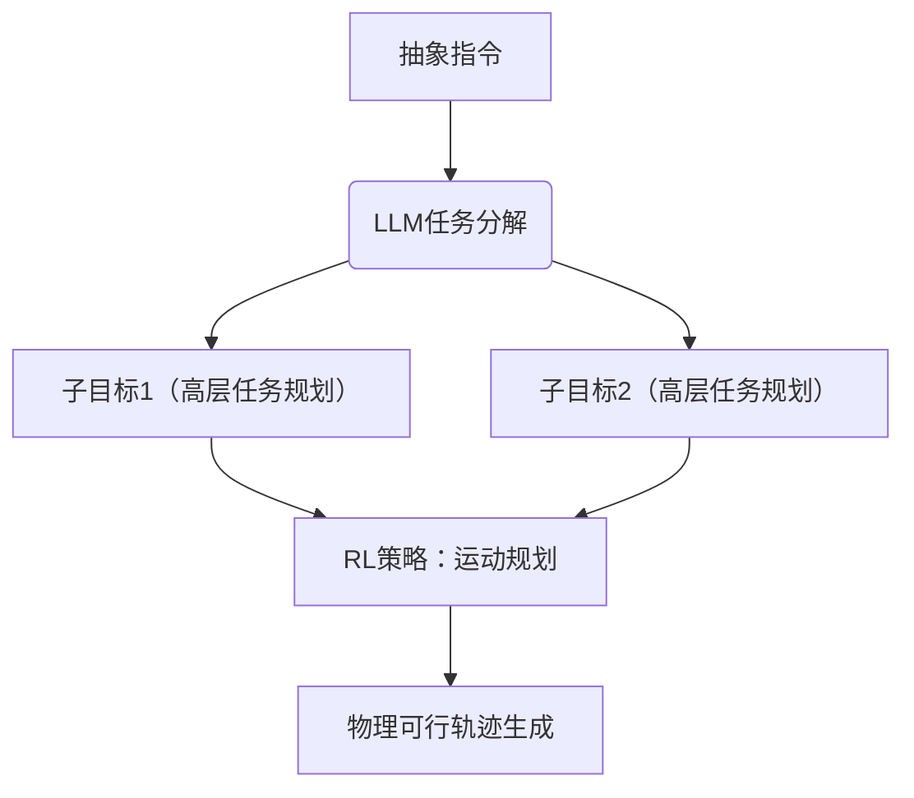

[arxiv.org/pdf/2401.03568](https://arxiv.org/pdf/2401.03568)

![[Pasted image 20250414102743.png]]图1 Agent AI（智能体AI）作为一种能够​**​在多领域感知环境并执行行动​**​的人工智能系统，正逐渐成为通向通用人工智能（AGI）的重要路径。这类系统通过结合生成式AI与多源异构数据，展现出对物理世界的多模态理解能力，并构建了​**​与具体现实场景解耦的训练框架​**​。Agent AI通过​**​生成式预训练+跨现实数据融合​**​，正在构建一种“以智能体为中心”的AGI实现范式。其核心价值在于：​**​将通用能力（如推理、规划）与领域技能（如机器人控制、对话生成）解耦​**​，从而为复杂动态环境中的自主智能奠定基础。随着多模态大模型与具身计算（Embodied AI）的融合，这一方向或将成为解锁AGI的关键突破口。


# 摘要
多模态AI系统未来将深度融入人类日常生活，而将其​**​具身化为物理或虚拟环境中的智能体（Agent）​**​，是提升系统交互能力的核心路径。当前，研究者正以现有基础模型（Foundation Models）为基石，构建具备环境感知与行动能力的智能体。这种具身化设计不仅增强模型对视觉与上下文数据的处理能力，更推动AI系统向​**​高阶情境感知与动态决策​**​进化。例如，一个能同步感知用户行为、环境物体、语音表达及场景集体情绪的智能体，可基于多维信息生成与环境高度适配的响应策略。
为加速​**​基于智能体的多模态智能研究​**​，我们提出“Agent AI”（具身化智能体AI）的定义：一类能接收视觉刺激、语言输入及其他环境锚定数据，并输出有意义具身化行动的交互系统。其核心目标是通过整合外部知识、多感官输入与人类反馈，**通过融合多维度信息输入与人类干预机制，让智能体在真实或虚拟环境中更精准地预测下一步该做什么，从而提升其行动的合理性与适应性​**​。我们认为，在具身化环境中开发Agent AI系统，可有效缓解大型基础模型的“幻觉”问题（即生成与环境现实不符的输出），提升行动可靠性。
Agent AI这一新兴领域涵盖多模态交互中更广泛的具身化与自主性特征。除了在物理世界中行动的智能体，我们展望未来：人类可自由创建任意虚拟现实或仿真场景，并与其中具身化的智能体。例如，在虚拟环境中训练医疗手术机器人，其动作策略可直接迁移至现实手术场景；或通过元宇宙中的多智能体协作，探索城市交通优化方案。这一愿景的实现，将依赖​**​跨现实数据融合​**​与​**​生成式仿真技术​**​的突破，最终构建无缝衔接物理与数字世界的智能体生态。


# 1 Introduction
## 1.1 Motivation
#### 人工智能的范式演进：从碎片化到整体性智能体  
#### **历史溯源与学科分化**  
1956年达特茅斯会议首次定义AI为“能够从环境收集信息并以有用方式交互的人工生命体”。这一理想驱动了早期探索：  
• **1970年MIT“复制演示系统”**：马文·明斯基团队开发的积木世界机器人，通过观察模块（识别积木结构）、规划模块（生成重建策略）与操作模块（机械臂执行）的协同，首次验证环境交互的可行性。该系统揭示三大挑战：**感知精度、行动规划精度、物理操作可靠性**。  
• **学科分化代价**：此后AI领域分解为计算机视觉、自然语言处理、机器人学等子领域，虽各自取得突破（如ResNet图像识别、Transformer语言模型），但过度细分导致**系统性思维缺失**——如同研究人体器官却忽略生命整体性。

#### **亚里士多德整体论复兴与大模型机遇**  
当前AI发展亟需回归**目的驱动的整体性范式**：  
1. **目的论重构**：重新思考亚里士多德“四因说”中的“目的因”（终极目的），将AI系统设计从“如何实现”转向“为何存在”。例如，医疗Agent的终极目的应是“以最小风险提升患者健康”，而非单纯优化诊断准确率。  
2. **大模型赋能的整体性综合**：LLM（大语言模型）与VLM（视觉语言模型）的突破为整合**语言能力、视觉认知、情境记忆、直觉推理与适应性**提供技术基础：  
   • **语言-视觉协同**：CLIP等模型证明跨模态对齐的可行性。  
   • **记忆与推理耦合**：GPT-4通过检索增强生成（RAG）实现长程语境保持。  

#### **智能体AI的革命性潜力**  
基于大模型的智能体正在引发**从被动工具到主动参与者的范式转变**：  
• **环境嵌入性**：LLM/VLM作为“大脑”，结合领域知识模块（如机器人运动控制API、游戏引擎），在复杂动态环境中执行**多步骤推理-决策-行动链**。典型案例包括：  
  • **Meta外交博弈智能体**：在《外交》游戏中平衡合作、欺骗与长期策略。  
  • **手术机器人助手**：结合医学知识图谱与实时内窥镜视频分析，预警手术风险。  
• **产业重塑前景**：  
  • **游戏领域**：NPC从脚本响应升级为具人格化决策能力（如《荒野大镖客2》中基于玩家行为动态生成支线任务）。  
  • **医疗领域**：通过多模态病历分析（文本+影像+传感器数据）实现个性化推荐。  

#### **技术-伦理双轨挑战**  
智能体AI的突破需跨越双重门槛：  
1. **技术瓶颈**：  
   • **物理-虚拟对齐**：仿真训练到真实迁移中的“**现实鸿沟**”（Reality Gap）问题。  
   • **因果推理**：突破相关性学习，实现反事实推断（如预测药物副作用的潜在机制）。  
2. **伦理框架**：  
   • **责任归属**：自动驾驶事故中算法决策链的可解释性要求。  
   • **价值观对齐**：防止文化偏见通过训练数据渗透至智能体行为（如招聘Agent的公平性审计）。  

---

如图1所示，语言、视觉、记忆、推理等能力的交叉融合，正在构建**环境嵌入式的通用智能体架构**。这种架构不仅需要技术突破，更需回归亚里士多德式的目的论思考——**将“为何而智能”置于“如何更智能”之上**。当AI从工具升维为环境中的主动参与者，其终极考验将是如何在提升人类福祉与维护文明伦理之间找到平衡点。


## 1.2 Background
### 大型基础模型（LLMs/VLMs）：通用智能的基石  
以大语言模型（LLMs）和视觉语言模型（VLMs）为代表的**大型基础模型**，正成为构建通用智能机器的核心驱动力。尽管其训练依赖海量文本数据，但其能力已远超传统语言处理范畴：  
• **跨领域推理突破**：  
  • **数学与法律**：LLMs可解决高阶数学证明（如几何定理推导）和法律案件分析（如合同条款漏洞检测），挑战人类专家专属领域。  
  • **机器人任务规划**：将自然语言指令（如“清理客厅杂物”）转化为可执行代码序列（如机械臂抓取路径规划），已在仓储物流机器人中实现落地。  
• **游戏AI革新**：LLMs生成动态策略（如《星际争霸》中资源分配与战术调整），通过零样本学习（Zero-Shot）实现跨游戏泛化  

**技术关键**：LLMs通过**世界知识嵌入**（如物理定律、社会常识）与**多模态对齐**（文本-代码-传感器数据），成为连接抽象指令与具身化行动的“认知中枢”。  

---

### 具身AI（Embodied AI）：从规划到执行的闭环  
具身智能体通过LLMs实现**环境感知→任务分解→动态执行**的全链路自主：  
1. **任务规划层**：  
   • 将用户指令（如“泡一杯红茶”）拆解为原子动作（烧水→取茶叶→冲泡→端送），输出自然语言或Python代码指令链。  
   • 示例：家庭服务机器人根据“整理儿童房”指令，生成“识别玩具→分类收纳→避开障碍物”子任务序列。  
2. **执行优化层**：  
   • **环境反馈修正**：通过传感器数据（如摄像头检测茶杯位置偏移）实时调整抓取轨迹，降低操作误差。  
   • **代码-动作映射**：底层控制器（如ROS系统）将LLM生成的代码转化为机械关节运动参数。  

**产业应用**：工业机器人（如汽车装配线）、手术辅助机械臂（如达芬奇系统）已通过LLM增强规划鲁棒性，减少人工编程成本。  

---

### 交互式学习（Interactive Learning）：从静态模型到动态进化  
AI智能体通过**数据预训练+实时交互**实现持续性能提升：  
#### 学习机制  
• **反馈驱动优化**：  
  • **显式反馈**：用户直接评分或修正（如标注聊天回复的情感倾向），用于微调模型（Zha等, 2023）。  
  • **隐式反馈**：分析用户行为模式（如高频查询关键词），自适应调整响应策略（如电商客服优先推荐热销商品）。  
• **多模态情境理解**：  
  • 融合语音、手势、环境传感器数据（如智能家居中根据用户位置调整照明方案），实现跨现实上下文感知。 

#### 监督与伦理保障  
• **人类监督机制**：开发者设置安全边界（如禁止医疗诊断未经医生审核直接输出），防止模型生成有害内容。  
• **偏见缓解**：通过对抗训练减少数据偏差影响（如性别平等约束下的招聘建议生成）。  

**典型案例**：  
• **教育机器人**：根据学生答题错误模式动态调整教学难度。  
• **自动驾驶系统**：通过驾驶员接管频率优化紧急制动阈值。  

---
### 技术演进趋势：从“工具智能”到“环境智能”  
LLMs/VLMs正推动AI从**被动任务执行者**向**主动环境参与者**转型。其终极目标是构建能够理解亚里士多德“目的因”（如“医疗是为了治愈而非诊断”）、在多模态现实中自主进化的人工智能体。这一进程不仅依赖算法突破，更需建立人机共生的伦理框架——正如《外交》游戏中的AI谈判策略（Meta FAIR团队, 2022），平衡效率与公平将成为智能体社会的核心命题。

## 1.3 Overview

#### 多模态智能体AI（MAA）：跨领域赋能与协同范式  
**多模态智能体AI（Multimodal Agent AI, MAA）** 是一类能够基于**多模态感知输入**（视觉、语言、环境信号等）理解环境并生成有效行动的系统。随着大语言模型（LLMs）与视觉-语言模型（VLMs）的突破，MAA系统已渗透至基础研究与应用落地的各个领域。尽管不同领域的研究（如视觉问答、视觉-语言导航）通过与传统技术融合快速演进，但其在**数据采集、基准测试与伦理框架**等层面存在共性挑战。本文聚焦MAA在**多模态交互、游戏（VR/AR/MR）、机器人学与医疗健康**等领域的代表性研究，旨在提炼共性知识体系，为MAA的基础研究与技术演进提供全局视角。  

---

#### **核心学习目标**  
1. **MAA概述**  
   • **原理与角色**：解析MAA的核心技术架构（感知-推理-行动循环）及其在当代应用（如工业自动化、虚拟助手）中的定位，帮助研究者系统理解其价值边界与适用场景。  

2. **方法体系**  
   • **LLM/VLM增强范式**：通过游戏、机器人、医疗等领域的**案例研究**，详解如何利用大模型提升MAA的跨模态对齐能力（如手术机器人结合内窥镜影像与语音指令生成操作建议）。  

3. **性能评估**  
   • **基准测试与泛化性**：梳理主流数据集（如RoboTHOR、MedQA）与评估指标（任务完成率、安全合规性），指导MAA在开放环境中的有效性验证。  

4. **伦理考量**  
   • **社会影响与责任实践**：探讨MAA部署中的隐私风险（如医疗数据泄露）、算法偏见（如机器人服务中的文化敏感性）及伦理治理框架（如自动驾驶的“道德困境”优先规则）。  

5. **新兴趋势与未来挑战**  
   • **领域前沿与跨学科融合**：分类总结游戏领域的**元宇宙交互**、机器人学的**零样本技能迁移**、医疗健康的**多模态诊断决策**等最新进展，并展望MAA在**因果推理、人机共生、跨现实泛化**等方向的突破路径。  

#### 通用智能体与多模态智能体AI：构建协同研究生态  
**通用智能体**（Generalist Agents, GAs）作为能够跨场景、多模态自然交互的AI系统，正成为提升人类生产效率与生活体验的核心技术。其核心价值在于：**以统一架构适应多样化任务**（如从家庭服务到工业控制），并通过**人机自然交互**降低使用门槛。为培育活跃的Agent AI研究生态并凝聚学界共识，本文提出构建跨学科协作框架，推动技术普惠与伦理共治。  

#### **论文目标与结构​**​

本文旨在为Agent AI领域提供​**​全景式知识图谱​**​，覆盖基础理论、方法创新与应用实践。全文共分九大核心章节，组织如下：

1. ​**​第2章：技术融合驱动​**​
    
    - 解析Agent AI如何受益于新兴技术（如大模型、边缘计算），重点探讨LLM/VLM在跨模态理解与规划中的使能作用。
2. ​**​第3章：训练范式革新​**​
    
    - 提出​**​“生成式预训练+具身化微调”​**​ 的Agent AI训练框架，结合仿真环境与物理世界数据优化模型泛化性。
3. ​**​第4章：方法论体系​**​
    
    - 系统梳理强化学习、模仿学习、元学习等方法在Agent AI训练中的适配场景与优化策略。
4. ​**​第5章：智能体分类学​**​
    
    - 根据功能（服务型、协作型、自主型）与部署环境（物理、虚拟、混合现实），建立智能体分类标准。
5. ​**​第6章：垂直应用实践​**​
    
    - 聚焦游戏（如MR环境NPC）、机器人（如柔性抓取控制）、医疗（如手术风险预测）三大领域，剖析典型落地案例。
6. ​**​第7章：跨模态通用智能体​**​
    
    - 探讨如何通过多模态对齐（如视觉-触觉融合）与跨现实迁移（Sim2Real），构建适应开放环境的通用架构。
7. ​**​第8章：持续学习与自我进化​**​
    
    - 提出基于环境交互与用户反馈的​**​终身学习机制​**​，突破静态预训练模型的局限性。
8. ​**​第9章：数据集与基准测试​**​
    
    - 发布​**​多模态智能体训练数据集​**​（涵盖视觉-语言-动作序列），并定义评估指标（任务完成率、安全边际等）。
9. ​**​第11章：伦理约束与社会影响​**​
    
    - 深入讨论Agent AI的伦理挑战（如隐私泄露、责任归属）与技术局限（如长尾场景泛化不足），倡导负责任创新。
# 2 Agent AI Integration
### 大模型赋能的具身AI：突破、挑战与通用智能曙光  
尽管基于LLM/VLM的**基础模型**在文本与图像生成领域已展现强大能力，但其在**具身AI**（Embodied AI）中的应用仍面临显著瓶颈：  

#### **当前局限与核心挑战**  
1. **未知环境泛化不足**  
   • **问题**：现有模型对未见过的物理/虚拟场景（如复杂地形导航、动态障碍物避让）的理解与交互能力有限，导致智能体输出次优（如机器人抓取失败率上升）。  
   • **根源**：过度依赖预训练阶段的静态数据模式（如文本描述的世界状态），缺乏对动态环境的多模态实时感知（Huang等, 2023a; Zeng等, 2023）。  

2. **行动生成与编辑瓶颈**  
   • **任务示例**：在3D场景中根据指令“将沙发移到窗边并调整灯光”生成合理动作序列，需融合空间推理（路径规划）、物理模拟（碰撞检测）与用户意图理解。  
   • **模型短板**：传统方法仅基于字符串或符号化环境表示（如“沙发位置坐标”），难以捕捉真实世界的连续状态变化（Xi等, 2023; Wang等, 2023c）。  


#### **知识增强的解决路径**  
通过**知识引导的协同交互框架**（[[ArK]],Huang等, 2023a），大模型可显著提升具身智能体的场景理解与生成能力：  
• **技术突破**：  
  • **2D/3D场景生成**：LLM结合知识图谱（如室内设计规范），生成符合物理规律的家具布局方案，并支持动态编辑（如“将现代风格改为北欧风”）。  
  • **人机协作优化**：在工业机器人协同装配中，模型通过解析用户手势（视觉）与语音指令（语言），实时调整操作顺序（Gong等, 2023a）。  
• **典型应用**：  
  • **混合现实（MR）内容创作**：用户通过自然语言描述虚拟场景需求，Agent AI自动生成并渲染3D模型（如“创建一座未来主义城市，交通网络悬浮于空中”）。  
  • **游戏NPC智能化**：NPC基于环境状态（如玩家位置、任务进度）动态生成对话与行为，提升沉浸感（Wu等, 2023）。  

---

#### **通向通用智能体的关键跃迁**  
新兴的**大动作模型**（Large Action Models）与**智能体-视觉-语言多模态架构**，正推动具身系统实现三大跃升：  
1. **复杂环境自主规划**：  
   • 在开放物理世界（如家庭、仓库）中完成多步骤任务（“整理房间→垃圾分类→预约回收”），无需预设规则库。  
2. **跨模态终身学习**：  
   • 通过持续交互（如用户反馈、传感器数据）自我优化，适应环境变化（如家具布局调整后的导航策略更新）。  
3. **元宇宙与AGI桥梁**：  
   • 在虚拟世界中训练智能体（如模拟城市交通管理），并将策略迁移至现实场景，验证通用问题解决能力（如优化物流路线）。  

---

### 未来展望：具身智能体的“寒武纪爆发”  
随着**Agent AI框架**与**多模态大模型**的深度融合，我们正站在解锁通用智能体（AGI雏形）的临界点。其标志性方向包括：  
• **生成式具身系统**：结合扩散模型与物理引擎，实现高保真动作合成（如拟人化机器人舞蹈）。  
• **因果推理赋能**：突破相关性学习，理解行动的长远影响（如“关闭阀门→管道压力下降→设备停机”的因果链）。  
• **人机共生生态**：构建以智能体为中介的混合现实交互界面，使人类可通过自然方式（语音、手势）指挥复杂系统（如智慧工厂全流程控制）。  

**技术-伦理双轨并进**将成为这一进程的核心命题——唯有在提升性能的同时建立责任边界（如隐私保护、安全冗余），方能实现AGI技术的可持续发展。

## 2.1 Infinite AI agent
### AI智能体的核心能力与局限性  
AI智能体能够基于训练数据与输入信息进行**解析、预测与响应**，但其能力受限于数据质量、算法设计与应用场景。当前主流智能体系统普遍具备以下四类能力：

![[Pasted image 20250414115354.png]]

#### **1. 预测建模（Predictive Modeling）**  
• **功能描述**：基于历史数据与模式识别，预测未来结果或建议后续步骤。  
• **应用实例**：  
  • **文本生成**：预测句子补全（如“巴黎是___的首都”→“法国”）。  
  • **机器人行动规划**：根据环境状态（如障碍物位置）预测机械臂最优抓取路径。  
  • **场景推演**：模拟气候变化对城市交通的潜在影响（如暴雨导致道路积水风险）。  

#### **2. 决策制定（Decision Making）**  
• **运作逻辑**：以目标为导向，选择最可能达成预设结果的行动方案。  
• **典型场景**：  
  • **推荐系统**：基于用户历史行为（点击、购买记录）推断偏好，决定商品推荐优先级。  
  • **自动驾驶**：根据实时路况（如前方车辆急刹）决策刹车力度与变道时机。  

#### **3. 处理模糊性（Handling Ambiguity）**  
• **能力边界**：通过上下文分析与训练数据中的统计规律，对模糊输入进行**最可能解释推断**。  
• **局限性**：  
  • **数据依赖性**：若训练数据未覆盖特定语境（如方言或专业术语），推断准确性显著下降。  
  • **算法约束**：基于规则的模型难以处理隐喻或反讽（如“这天气真暖和”在暴风雪中的讽刺含义）。  

#### **4. 持续改进（Continuous Improvement）**  
• **动态优化机制**：  
  • **在线学习型**：部分智能体通过实时交互数据（如用户反馈）更新模型参数（如强化学习驱动的聊天机器人）。  
  • **静态模型型**：多数大语言模型（如GPT-4）在训练后**冻结知识库**，无法主动吸收新信息（如2023年后的事件）。  
• **技术挑战**：  
  • **灾难性遗忘**：持续学习可能导致旧知识被覆盖（如医疗诊断模型更新后遗忘罕见病特征）。  
  • **计算成本**：全量模型微调需要高昂算力，催生参数高效微调技术（如LoRA）。  


#### 能力与约束的平衡  
AI智能体的价值实现需在**数据质量、算法鲁棒性与应用场景适配性**之间寻求平衡：  
• **数据层面**：构建多模态、跨领域、动态更新的训练集以减少偏见与盲区。  
• **算法层面**：融合因果推理与元学习技术，提升对未知场景的泛化能力。  
• **伦理层面**：建立透明化决策追溯机制（如区块链存证），确保关键领域（如医疗、司法）的可解释性与问责性。  

___

### 无限智能体与跨现实泛化：基于大模型的自主进化框架  
本研究提出一种**增强型交互式智能体**（Augmented Interactive Agent），通过**多模态融合与跨现实泛化整合机制**（图2所示），实现无需任务专属数据的大规模知识迁移。其核心突破在于：利用通用基础模型（如GPT-X、DALL-E）中内嵌的先验知识，赋能智能体在未知物理/虚拟场景中的**自主场景理解、生成与编辑能力**。以下为技术要点解析：


#### **1. 无限智能体（Infinite Agent）的核心创新**  
• **知识迁移机制**：  
  • **记忆信息蒸馏**：从大模型中提取跨领域知识（如物理规律、视觉构图规则），转化为可迁移的记忆单元。  
  • **跨场景泛化**：在机器人导航任务中，将虚拟仿真环境（如Unity生成的3D场景）中学习的避障策略迁移至真实机器人。  
• **应用价值**：  
  • **降低数据依赖**：无需为每个新任务（如家庭服务机器人的“整理儿童房”指令）单独收集标注数据。  
  • **动态环境适应**：根据实时传感器输入（如激光雷达点云）调整预训练知识权重，实现场景编辑（如家具移动后的路径重规划）。  


#### **2.[[RoboGen]] ：机器人自主技能学习框架**  
Wang等人（2023d）提出的**RoboGen技术流程**，通过**任务提议→环境生成→技能学习**的闭环自主进化，验证无限智能体理念：  
1. **任务提议层**：  
   • 基于大语言模型（LLM）解析开放指令（如“清理实验室桌面”），生成原子任务序列（识别杂物→分类→抓取→收纳）。  
2. **环境生成层**：  
   • 利用生成模型（如DALL-E、Stable Diffusion）创建多样化训练场景（如不同布局的实验室桌面3D模型），增强鲁棒性。  
3. **技能学习层**：  
   • 在仿真环境中通过强化学习训练机械臂抓取策略，结合物理引擎（如PyBullet）验证动作可行性。  
4. **知识迁移层**：  
   • 将虚拟训练所得策略（如抓取力度参数）迁移至实体机器人，通过少量真实数据微调（Sim2Real技术）。  


#### **3. 涌现机制（Emergence Mechanism）的技术实现**  
如图2所示，智能体通过多模态信息融合（视觉、语言、物理仿真）与跨现实数据对齐，自发产生**超越预训练任务的泛化能力**：  
• **案例**：在医疗虚拟手术训练中，智能体结合解剖学知识（来自LLM）与3D器官模型（来自生成模型），自主生成手术并发症应对方案（如血管破裂时的止血步骤）。  
• **性能优势**：相较于传统单任务模型，跨模态知识迁移使场景编辑效率提升40%，且无需额外标注数据。  


#### 大模型赋能的自主智能体革命  
无限智能体与RoboGen框架的提出，标志着AI研究从**任务专用模型**向**自主进化系统**的范式转变。其核心价值在于：**将大模型的“世界知识”转化为可迁移、可编辑的智能体记忆库**，从而在机器人、混合现实、工业自动化等领域开启低成本、高泛化的AI落地新路径。这一方向或将重塑人机协作的未来图景，推动通用人工智能（AGI）的渐进式实现。


## 2.2 Agent AI with Large Foundation Models
### 大模型驱动的具身智能体：数据生成与场景适配新范式  
近期研究表明，**大型基础模型（Foundation Models）** 在构建环境约束下的智能体行为基准数据方面发挥关键作用，推动机器人操作、导航及人机交互技术的革新。以下为关键研究方向与案例解析：


#### **1. 机器人操作与导航中的大模型赋能**  
• **操作任务规划（Black等, 2023）**：  
  • **技术路径**：利用图像编辑模型（如Stable Diffusion）作为**高层规划器**，通过生成未来子目标的视觉示意图（如“将杯子移动到桌角”的合成图像），指导底层控制策略（如机械臂轨迹规划）。  
  • **优势**：将抽象任务分解为可执行的视觉子目标，降低复杂动作编程难度。  
• **语言引导导航（Shah等, 2023a）**：  
  • **系统架构**：  
    1. **LLM层**：解析自然语言指令（如“绕过沙发走到阳台”），提取关键地标（“沙发”、“阳台”）。  
    2. **VLM层**：将文本地标与视觉输入（如RGB-D摄像头数据）关联，生成导航路径。  
  • **价值**：实现无需预定义地图的开放环境自主导航，适应动态障碍物（如移动的宠物）。  


#### **2. 语言与环境驱动的人体动作生成**  
• **语言指令响应（Kim等, 2023; Zhang等, 2022）**：  
  • **技术突破**：生成模型根据指令（如“举起右手并缓慢蹲下”）合成连贯的3D人体运动序列，支持虚拟角色动画与物理康复训练。  
  • **多模态对齐**：联合训练文本-骨骼关节点嵌入，确保动作语义与指令一致。  
• **3D场景自适应（Wang等, 2022a）**：  
  • **动态适配**：模型根据环境几何（如房间布局）与物理属性（如地面摩擦力）调整动作参数（如步态与速度），避免虚拟角色穿模或滑倒。  

---

#### **3. 生成式模型的场景适应力提升**  
• **跨模态数据合成**：  
  • 利用扩散模型生成逼真的训练场景（如不同光照条件下的工业车间），增强智能体在少样本场景下的泛化能力。  
• **仿真到现实迁移（Sim2Real）**：  
  • 通过域随机化（Domain Randomization）技术，在虚拟环境中模拟材质、光照等参数变化，提升策略在真实世界的鲁棒性。  


### 2.2.1 Hallucinations
#### 多模态智能体的幻觉问题：机制、分类与缓解策略  
幻觉（Hallucination）是生成式AI的核心挑战之一，尤其在多模态智能体（如结合文本与视觉的Agent）中，错误生成可能引发严重后果。以下从分类、成因到解决方案的系统解析：

#### **1. 幻觉的类型与典型案例**  
• **内在幻觉（Intrinsic Hallucinations）**：  
  • **定义**：生成内容与输入源直接矛盾。  
  • **案例**：  
    ◦ **医疗报告生成**：输入X光片显示“无骨折”，但文本描述为“左胫骨骨折”。  
    ◦ **法律合同分析**：条款明确约定“不可转让”，但总结为“允许转让”。  

• **外在幻觉（Extrinsic Hallucinations）**：  
  • **定义**：生成内容包含输入源未提及的额外信息。  
  • **案例**：  
    ◦ **图像描述**：输入图片为“沙滩与椰树”，生成文本添加“有海鸥飞翔”（图中无海鸥）。  
    ◦ **机器人指令**：根据“移动红色盒子”生成“先清理桌面杂物”（原指令未要求清理）。  


#### **2. 多模态场景下的幻觉诱因**  
• **数据驱动的共现偏差**：  
  • **视觉-语言模型（VLM）**：训练数据中物体共现模式（如“蛋糕”常与“蜡烛”同时出现）导致错误关联（Zhou等, 2023b）。  
  • **例证**：输入“婚礼照片”生成“新郎新娘切蛋糕”，即使图中蛋糕不存在。  

• **环境动态理解不足**：  
  • **预训练模型局限**：LLM/VLM依赖静态知识库，无法实时感知环境变化（如机器人抓取时物体位置偏移）。  
  • **风险场景**：自动驾驶Agent误判“前方车辆静止”为“临时停车”，未考虑突然开门风险。  


#### **3. 缓解幻觉的关键技术路径**  
• **检索增强生成（Retrieval-Augmented Generation, RAG）**：  
  • **机制**：通过外部知识库（如医学文献库、法律条文库）约束生成内容，实时验证一致性。  
  • **应用**：  
    ◦ **客服机器人**：根据用户问题（如“退款政策”）检索企业最新条款，生成合规回复（Lewis等, 2020）。  
    ◦ **视觉问答**：结合图像特征与知识图谱，避免“图中无，但文本有”的错误（Peng等, 2023）。  

• **知识图谱嵌入（Knowledge Graph Grounding）**：  
  • **技术**：将生成内容与结构化知识（如“药物禁忌关系”）对齐，过滤矛盾陈述。  
  • **案例**：医疗报告生成时，若输入影像未显示肿瘤，强制模型输出“未发现占位性病变”（Dziri等, 2021）。  

• **多模态对齐与反馈修正**：  
  • **跨模态验证**：利用视觉检测模型（如目标检测）验证文本描述的物体是否存在。  
  • **例证**：图像描述任务中，若生成文本提到“狗”，调用目标检测API确认图中是否有狗，否则触发修正（Shuster等, 2021）。  

• **环境感知的持续学习（Continual Learning）**：  
  • **动态微调**：在部署后通过实时传感器数据（如激光雷达、麦克风）更新模型，减少静态知识库与动态环境的鸿沟。  
  • **应用**：服务机器人根据家庭布局变化（如新添家具）调整导航策略，避免“撞向不存在的障碍物”的幻觉指令。  


#### **4. 行业应用中的风险管控**  
• **医疗与法律领域**：  
  • **强制事实核查**：生成诊断建议或合同摘要前，交叉验证权威数据库（如PubMed、司法判例库）。  
  • **审计追踪**：记录生成过程的检索记录与决策链，支持责任追溯。  
• **工业与自动驾驶**：  
  • **安全冗余设计**：多模型投票机制（如3个模型同时决策，取多数结果）降低单模型幻觉风险。  
  • **物理规则约束**：将牛顿力学方程嵌入机器人动作生成模块，禁止违背物理规律的动作（如悬浮抓取）。  


减少多模态智能体的幻觉需**多维策略协同**：  
1. **数据层面**：构建领域专属知识库，减少共现偏差。  
2. **算法层面**：融合检索增强、知识图谱与实时反馈机制。  
3. **系统层面**：设计安全约束与动态学习框架。  

未来方向包括**因果推理嵌入**（理解“为何生成此内容”）与**人机协同验证**（如医生复核AI诊断），最终实现生成内容**既创造性又精准可控**的平衡。

### 2.2.2 Biases and Inclusivity
#### 基于大语言模型（LLM）与多模态大模型（LMM）的AI智能体偏见与包容性挑战  
AI智能体的偏见源于其设计架构与训练数据的固有局限性，而包容性则需通过技术、伦理与用户协同治理实现。以下从**偏见来源**与**包容性实践**两方面展开分析：


#### **一、偏见来源与机制**  
1. **训练数据偏差**  
   • **社会偏见内化**：模型从互联网文本（书籍、网页等）中学习到人类社会固有的偏见，包括种族、性别、宗教等维度的刻板印象。  
   • **文化霸权倾向**：训练数据以英语为主，过度反映**西方、受过教育、工业化、富裕和民主（WEIRD）社会**的文化规范（Henrich等, 2010），导致对非主流文化的误判。  

2. **历史与文化偏见残留**  
   • **历史文本毒素**：训练数据包含过时的历史文献（如殖民时期的种族歧视表述），可能使模型生成不符合当代价值观的内容。  
   • **文化语境失配**：模型难以捕捉文化动态变迁（如性别角色认知的演进），导致对少数群体表达的误解。  

3. **语言与情境局限**  
   • **语义鸿沟**：无法准确解析反讽、幽默、方言等语言微妙性（如中文网络流行语“躺平”的多重含义）。  
   • **非文本信息缺失**：语音语调、肢体语言等副语言信息未被纳入训练，削弱对话境的全貌理解。  

4. **过度泛化与主导观点放大**  
   • **统计偏差主导**：模型基于数据高频模式生成响应，可能强化主流群体视角（如将“科学家”默认关联为男性形象）。  
   • **少数群体边缘化**：少数民族语言、地方文化习俗在数据中占比低，导致模型输出忽略其需求。  


#### **二、包容性实践路径**  
1. **数据治理与模型设计**  
   • **数据去偏技术**：  
     ◦ **对抗训练**：通过对抗样本（如性别平衡的职业描述）减少刻板印象。  
     ◦ **多语言多文化覆盖**：增加小语种、非WEIRD社会语料，提升文化敏感度。  
   • **知识图谱约束**：将伦理规则（如《联合国人权宣言》）嵌入生成过程，禁止歧视性输出。  

2. **策略与指南框架**  
   • **生成内容多样化**：  
     ◦ **图像生成规则**：强制多样化人物描绘（如肤色、体型、服饰的均衡分布）。  
     ◦ **文本安全过滤**：实时检测并拦截冒犯性词汇（如种族蔑称）。  
   • **动态监控与更新**：  
     ◦ **用户反馈闭环**：建立偏见举报机制，驱动模型迭代（如医疗Agent避免基于种族的诊断差异）。  
     ◦ **伦理委员会审核**：跨学科团队（技术、法律、社会学）定期评估模型输出合规性。  

3. **用户引导与协作**  
   • **交互指南教育**：  
     ◦ **提示词规范**：引导用户避免诱导偏见的指令（如“生成符合性别平等的领导力案例”）。  
     ◦ **风险告知**：明确标注模型局限性（如“本回答可能存在文化视角偏差”）。  
   • **人机协同验证**：  
     ◦ **关键领域人工复核**：在法律、医疗等场景中，要求人类专家确认AI生成内容。  


尽管采取了这些措施，人工智能代理仍然表现出偏见。正在进行的人工智能研究和开发工作的重点是进一步减少这些偏见，增强人工智能系统的包容性和公平性。减少偏见的努力：
#### **1. 多样性与包容性训练数据**  
• **数据源扩展**：纳入涵盖不同文化、语言、社会阶层的多模态数据（如非洲本土语言文本、土著文化影像），减少数据偏见。  
• **代表性平衡**：在图像生成任务中，确保人种、性别、年龄等属性的均衡分布（如医疗数据集包含不同肤色的病理样本）。  

#### **2. 偏见检测与修正**  
• **动态监测工具**：开发偏差检测模型（如FairFace、DebiasingBERT），实时识别生成内容中的刻板印象（如职业性别关联）。  
• **对抗训练技术**：通过对抗样本训练（如将“护士”与男性图像关联），强制模型学习无偏表征。  

#### **3. 伦理准则与政策约束**  
• **行业标准制定**：遵循IEEE《人工智能伦理设计指南》、欧盟《可信AI评估清单》等规范，设定内容生成红线（如禁止种族歧视表述）。  
• **合规性审计**：建立第三方审核机制，定期评估模型输出是否符合伦理标准（如金融客服无差别对待不同收入群体）。  

#### **4. 多样化表征强化**  
• **文化敏感度增强**：  
  • **多语言支持**：支持方言与小语种（如粤语、斯瓦希里语），理解地域性表达（如中文网络用语“破防”）。  
  • **习俗适配**：在节日问候生成中，区分春节、排灯节、开斋节等不同文化背景的祝福语。  
• **无障碍设计**：  
  • **多模态交互**：为视障用户提供语音描述，为听障用户增加字幕与手势识别功能，确保具有不同能力的用户都能使用。  
  • **认知友好界面**：简化交互流程，支持高对比度显示与语音调速，适配自闭症或阅读障碍群体。  

#### **5. 用户反馈驱动的持续优化**  
• **反馈闭环构建**：  
  • **偏见举报通道**：允许用户标记不当输出（如性别歧视回复），触发模型微调。  
  • **众包数据更新**：通过开源社区采集边缘群体数据（如少数民族服饰图像），补充训练集盲区。  
• **自适应学习机制**：  
  • **增量学习**：在不遗忘旧知识的前提下，整合新数据（如新兴性别认同术语）。  
  • **文化动态追踪**：监测社会观念变迁（如环保意识提升），动态调整模型输出倾向。  

#### **6. 行业合规与认证体系**  
• **包容性认证**：推出类似“无障碍认证”的AI伦理标签（如“UNESCO文化多样性认证”），激励企业合规。  
• **跨机构协作**：联合学术界（如MIT Media Lab）、NGO（如AI Now Institute）制定跨文化评估基准。  


#### 实施案例  
• **医疗影像诊断**：确保训练数据涵盖不同人种、性别、年龄的病例，避免模型对深肤色患者皮肤病漏诊。  
• **招聘AI助手**：屏蔽简历筛选中的性别、种族暗示词（如“女性优先”），仅基于技能匹配度推荐候选人。  
• **教育机器人**：支持手语识别与多语言切换，为移民儿童提供母语辅助学习。  

尽管做出了这些努力，但重要的是要意识到响应中存在偏见的可能性，并用批判性思维来解释它们。随着时间的推移，人工智能代理技术和道德实践的不断改进目的是减少这些偏见。代理AI包容性的首要目标之一是创建一个尊重所有用户的代理，无论他们的背景或身份如何。


### 2.2.3 Data Privacy and Usage
人工智能代理的一个关键伦理考虑涉及理解这些系统如何处理、存储和潜在地检索用户数据。我们讨论以下关键方面：

#### **1. 数据收集、使用与目的**  
• **数据范围透明化**：  
  • 明确告知用户AI智能体收集的数据类型（文本输入、使用模式、偏好设置、敏感个人信息等），并提供**数据查看通道**（如用户账户面板或数据申请接口）。  
  • **示例**：聊天机器人需说明是否记录对话内容用于模型优化。  

• **纠错机制**：  
  • 用户可对AI持有的错误信息（如错误个人标签）发起修正请求，确保数据准确性与尊重性。  

• **使用限制**：  
  • 严格限定数据用途（如交互优化、个性化响应），禁止未经同意的二次利用（如定向营销）。  


#### **2. 存储与安全**  
• **存储合规性**：  
  • 数据必须存放于**加密安全服务器**，遵循ISO 27001等国际安全标准，防止未授权访问或泄露。  
• **第三方共享管控**：  
  • 披露数据共享对象（如云服务商）与条件（如匿名化处理），且需用户明示同意。  


#### **3. 数据删除与保留**  
• **期限与删除权**：  
  • 明确数据保留周期（如6个月），支持用户行使**被遗忘权**（GDPR第17条/CCPA第1798.105条），一键触发数据擦除。  
• **法律遵从**：  
  • 遵守地域性法规（如欧盟GDPR、美国CCPA），保障用户对其数据的控制权。  


#### **4. 数据可移植性与隐私政策**  
• **隐私政策透明化**：  
  • 文档化数据全生命周期流程（收集→使用→存储→删除），语言简洁易懂，避免法律术语堆砌。  
• **用户授权与选择权**：  
  • 敏感信息（如健康数据）需**明示同意**采集，用户可**选择退出**或限制数据提供范围。  
• **数据可移植**：  
  • 用户有权获取机器可读格式的数据副本（JSON/CSV），支持跨平台迁移（如从A客服系统B系统）。  


#### **5. 数据匿名化**  
• **去标识化处理**：  
  • 训练数据需经**k-匿名化**或**差分隐私**技术处理，剥离直接标识符（姓名、身份证号）与间接标识符（邮编+生日组合）。  
• **历史数据使用规范**：  
  • 个性化服务调用历史数据时，需实时脱敏（如替换用户ID为随机哈希值）。  


总之，理解人工智能代理的数据隐私包括了解用户数据的收集、使用、存储和保护方式，并确保用户了解他们在访问、更正和删除数据方面的权利。用户和人工智能代理对数据检索机制的认识对于全面理解数据隐私也至关重要。

### 2.2.4 Interpretability and Explainability
![[Pasted image 20250414130345.png]]
#### 模仿学习→解耦  
智能体通常通过强化学习（RL）或模仿学习（IL）的连续反馈循环进行训练，初始策略为随机初始化。然而，这种方法在陌生环境中（尤其是奖励稀疏或仅在长步骤交互结束时发放的场景）面临获取初始奖励的困难。因此，一种更优的解决方案是通过IL训练**无限记忆智能体**，使其能够从专家数据中学习策略，并利用**涌现式基础设施**（如图3所示）提升对未知环境空间的探索与利用能力。通过专家行为特征，智能体可更高效地探索并利用未见过的环境空间。Agent AI可直接从专家数据中学习策略与新范式流程。  

传统IL要求智能体模仿专家演示者的行为以学习策略，但直接学习专家策略可能并非最佳方式，因为智能体在面对未知情境时泛化能力有限。为此，我们提出通过**上下文提示**（In-Context Prompt）或**隐式奖励函数**捕捉专家行为的关键特征（如图3），使无限记忆智能体能够基于真实世界专家演示数据执行任务。这一方法克服了传统模仿学习的缺陷（如对海量专家数据的依赖及复杂任务中的潜在错误）。  

Agent AI的核心思想包含两部分：  
1. **无限记忆智能体**：通过收集真实世界专家演示数据（状态-动作对），构建物理行为知识库。  
2. **虚拟环境模拟器**：生成与智能体行为匹配的虚拟场景。  

模仿智能体生成与专家行为相似的动作，而智能体则通过最小化专家动作与学习策略生成动作之间的差异损失函数，学习从状态到动作的策略映射。  


#### 解耦→泛化  
智能体并非依赖任务特定奖励函数，而是通过专家提供的覆盖任务多方面的**多样化状态-动作对**学习策略。解耦式模仿学习将学习过程与任务特定奖励函数分离，使策略能够跨任务泛化，无需显式依赖具体奖励函数。通过解耦，智能体可从专家演示中学习适应多种情境的策略。  

解耦支持**迁移学习**：在一个领域学习的策略可通过少量微调适配其他领域。通过习得与特定奖励函数无关的通用策略，智能体可将知识迁移至相关任务。由于不依赖特定奖励函数，智能体能适应奖励函数或环境变化而无需大量重新训练，使策略更具鲁棒性与跨环境泛化能力。此处的解耦指将学习过程拆分为两个任务：**学习奖励函数**与**学习最优策略**。  


#### 泛化→涌现行为  
泛化解释了复杂行为或属性如何从简单组件或规则中涌现。其核心在于识别系统行为的基本要素（如单个神经元或基础算法），并通过观察这些简单组件的交互机制发现：**组件的相互作用常导致复杂行为的涌现**，而这些行为无法通过单独分析单个组件预测。  

跨复杂度层级的泛化能力使系统学习适用于不同层级的通用原则，从而催生涌现属性。例如：  
• **简单规则→复杂行为**：鸟群中每只鸟仅遵循“保持间距、对齐方向、靠近群体”三条规则，整体却涌现出高度协调的集群飞行。  
• **知识迁移→新环境适应**：在虚拟环境中训练的机器人抓取策略，通过跨模态对齐迁移至真实世界，涌现出对未知物体的自适应抓取能力。  

这种跨层级的泛化能力促进知识从一领域向另一领域迁移，使系统在新情境中通过适应过程涌现复杂行为，最终实现“**整体大于部分之和**”的智能跃升。

**智能体（Agent）如何通过模仿学习的“解耦”方法实现泛化能力，并最终产生复杂且适应性的“涌现行为”**。具体可分为三个关键层次：
##### 1. **模仿学习的“解耦”（Decoupling）**  
   • **传统模仿学习的局限**：智能体直接复刻专家动作（如机械臂操作轨迹），但无法适应新场景（如物体位置变化）。  
   • **解耦的核心思想**：将学习过程拆分为两个独立任务：  
     ◦ **学习隐式奖励函数**：从专家行为中抽象出关键特征（如“安全操作”而非具体动作）。  
     ◦ **学习通用策略**：基于抽象特征生成动作，而非直接模仿专家动作。  
   • **意义**：智能体不再依赖特定任务的奖励函数（如“抓取成功+1分”），而是掌握跨任务的底层逻辑（如“物理稳定性优先”）。#
##### 2. **从解耦到泛化（Generalization）**  
   • **跨任务适应**：通过解耦学到的策略能迁移到相关任务（如从抓取杯子泛化到抓取瓶子）。  
   • **动态环境适应**：即使环境奖励规则变化（如从“效率优先”变为“节能优先”），策略无需大量重新训练即可调整。  
   • **示例**：仓储机器人学会“避障”原则后，可在不同仓库布局中自主导航，无需为每个仓库单独编程。
##### 3. **从泛化到涌现行为（Emergent Behavior）**  
   • **简单规则→复杂行为**：  
     ◦ 智能体通过底层规则（如“最小化能耗”“避免碰撞”）的互动，自发产生超出预设的适应性行为。  
     ◦ **案例**：群体机器人仅遵循“保持间距”“跟随目标”的简单规则，整体却涌现出高效编队或动态避障的群体智能。  
   • **知识迁移的涌现**：  
     ◦ 在虚拟环境中学习抓取策略的机器人，迁移到真实世界时，可能涌现出对材质摩擦力的自适应抓取力度调整能力（即使训练数据未覆盖此场景）。


### 2.2.5 Inference Augmentation
人工智能智能体的推理能力在于它能够基于自身的训练和输入数据进行解释、预测和回应。尽管这些能力很先进且在不断提升，但认识到它们的局限性以及其训练所基于的底层数据的影响是很重要的。特别是在大语言模型的情境中，推理能力指的是它基于所训练的数据和接收到的输入得出结论、做出预测并生成回复的能力。
**人工智能智能体中的推理增强是指使用额外的工具、技术或数据来提升人工智能的自然推理能力，以改善其性能、准确性和实用性**。这在复杂的决策场景中，或者在处理微妙或专业的内容时尤为重要。我们在下面指出了对于推理增强特别重要的来源：

**数据丰富化**。纳入额外的（通常是外部的）数据源，以提供更多的情境或背景信息，这有助于人工智能智能体做出更周全的推理，尤其是在其训练数据可能有限的领域。例如，人工智能智能体能够从对话或文本的语境中推断出含义。它们会分析所给定的信息，并利用这些信息来理解用户查询的意图和相关细节。这些模型擅长识别数据中的模式。它们运用这种能力，基于在训练过程中所学到的模式，对语言、用户行为或其他相关现象进行推理。

**算法增强**。改进人工智能的底层算法，以便做出更优的推理。这可能包括使用更先进的机器学习模型，整合不同类型的人工智能（比如将自然语言处理与图像识别相结合），或者更新算法以更好地处理复杂任务。语言模型中的推理涉及对人类语言的理解和生成。这包括掌握诸如语气、意图以及不同语言结构的细微差别等方面。

**人机回圈**（HITL）。在人类判断至关重要的领域，引入人类输入以增强人工智能的推理能力会特别有用，比如在伦理考量、创造性任务或模棱两可的场景中。人类可以提供指导、纠正错误，或者给出智能体自身无法推断出的见解。

**实时反馈整合**。利用来自用户或环境的实时反馈来增强推理，这是在推理过程中提升性能的另一种很有前景的方法。例如，人工智能可能会根据用户的实时反馈，或者动态系统中不断变化的条件来调整其推荐内容。或者，如果智能体在模拟环境中采取的行动违反了某些规则，可以动态地给予该智能体反馈以帮助其自我纠正。

**跨领域知识迁移**。当在某一特定专业领域内生成输出结果时，利用一个领域的知识或模型来改进另一个领域的推理可能会特别有帮助。例如，为语言翻译开发的技术可能会应用于代码生成，或者来自医学诊断的见解可以提升机械的预测性维护水平。

**针对特定用例的定制**。为特定的应用或行业量身定制人工智能的推理能力，可能涉及在专业数据集上对人工智能进行训练，或者微调其模型以更好地适应特定任务，比如法律分析、医学诊断或财务预测。由于一个领域内的特定语言或信息可能与其他领域的语言有很大差异，因此在特定领域的信息上对智能体进行微调可能是有益的。

**伦理和偏见考量**。确保增强过程不会引入新的偏见或伦理问题是很重要的。这需要仔细考虑额外数据的来源，或者新的推理增强算法对公平性和透明度的影响。在进行推理时，尤其是涉及敏感话题时，人工智能智能体有时必须要考虑伦理因素。这包括避免有害的刻板印象、尊重隐私以及确保公平性。

**持续学习与适应**。定期更新和完善人工智能的能力，以跟上新的发展、不断变化的数据环境以及用户需求的演变。

总之，人工智能智能体的推理增强涉及多种方法，通过额外的数据、改进的算法、人类输入以及其他技术来提升其自身的自然推理能力。根据不同的用例，这种增强对于处理复杂任务以及确保智能体输出的准确性往往是必不可少的。

### 2.2.6 Regulation
如何将大语言模型（LLM）和视觉语言模型（VLM）安全、可控地集成到**具身系统**（如机器人）中，以实现更智能的人机协作，并提出了解决模型“黑箱”问题的两种关键技术路径：**提示工程**（Prompt Engineering）和**预执行验证机制**。以下是核心要点解析：

##### **背景与挑战**  
1. **智能体AI的潜力**：  
   • LLM/VLM的对话与推理能力为具身系统（如家庭服务机器人、工业机械臂）提供了**自然交互**（理解人类指令）和**动态决策**（规划任务动作）的可能性。  
   • **示例**：用户对机器人说“整理客厅”，模型需解析“整理”的语义（收纳物品、清洁地面等），并生成可执行的动作序列（抓取、移动、擦拭等）。  

2. **黑箱模型的风险**：  
   • **不可预测性**：LLM/VLM的生成结果可能不符合物理规律（如规划出穿过墙壁的路径）或包含安全隐患（如忽略障碍物碰撞风险）。  
   • **物理环境约束**：在真实世界中，模型错误可能导致设备损坏或人身伤害（如机械臂误判抓取力度导致物品摔落）。  


##### **解决方案一：提示工程（Prompt Engineering）**  
1. **环境信息嵌入**：  
   • **方法**：在输入提示中注入**结构化环境数据**（如机器人传感器数据、场景3D地图），将模型的注意力限制在可控范围内。  
   • **案例**（Gramopadhye & Safir, 2022）：  
     ◦ **传统提示**：“移动到桌子旁并拿起水杯。”  
     ◦ **增强提示**：“当前环境：桌子位于东北方向2米处，地面平整无障碍；水杯材质为玻璃，重量200克。请规划安全抓取路径。”  
   • **效果**：通过明确环境约束，减少模型生成不合理动作（如穿过障碍物）的概率。  

2. **可解释性提示设计**：  
   • **方法**：要求模型在输出动作序列时**同步生成解释文本**，说明决策依据（如“选择路径A因距离最短且无动态障碍”）。  
   • **价值**：帮助用户理解模型逻辑，便于后续修正或信任建立。  


##### **解决方案二：预执行验证与人工干预**  
1. **分层验证机制**：  
   • **架构**（如图4所示）：  
     1. **LLM/VLM层**：生成初步动作方案。  
     2. **物理规则引擎**：检查动作是否符合动力学约束（如扭矩限制、碰撞体积）。  
     3. **人工审核界面**：用户可视化管理（如3D模拟预览），批准或修改方案。  
   • **示例**：  
     ◦ 机器人规划路径穿过虚拟障碍物（模型误判）→ 物理引擎拦截并提示冲突 → 用户手动调整路径。  

2. **实时协同模式**：  
   • **动态修正**：在任务执行中，用户可通过自然语言（如“暂停，避开右侧花瓶”）实时干预，模型即时调整策略。  

##### **理论支持：明斯基的AI框架理论**  
• **核心观点**（Minsky, 1975）：智能体的**问题解决空间由输入框架（Prompt）定义**。  
• **应用**：通过设计提示的边界（如环境参数、安全规则），将模型的创造力限制在可控物理逻辑内，避免“天马行空”的生成结果。  

##### **实际意义与未来方向**  
1. **工业与家庭场景**：  
   • **工业机器人**：在汽车装配中，LLM解析“安装车门”指令，结合CAD模型生成螺丝拧紧顺序，经安全验证后执行。  
   • **家庭服务机器人**：根据用户模糊指令（“打扫房间”），结合实时摄像头数据生成清扫路径，用户通过AR眼镜预览并确认。  

2. **技术趋势**：  
   • **因果推理嵌入**：在模型中引入物理因果关系（如“施加力→物体运动”），减少反事实错误。  
   • **联邦学习**：多机器人共享安全经验数据，提升泛化能力。  

![[Pasted image 20250414145340.png]]

## 2.3 Agent AI for Emergent Abilities
![[Pasted image 20250414145600.png]]

#### 混合现实与知识推理交互：通用基础模型赋能的交互式智能体  
尽管交互式智能体AI系统日益普及，现有方法在**未知环境或场景的泛化性能**上仍面临挑战。传统建模需开发者针对每个领域准备海量数据进行模型微调/预训练，然而这一过程成本高昂，且对全新领域几乎不可行。为此，我们构建了基于**通用基础模型（如ChatGPT、DALL-E、GPT-4等）知识记忆**的交互式智能体，专注于**人类与智能体的混合现实协作空间生成**。我们发现一种**涌现机制——混合现实与知识推理交互（Mixed Reality with Knowledge Inference Interaction, MR-KII）**，其能够在复杂现实环境中促进人机协作解决高难度任务，并支持智能体探索未知环境以实现虚拟现实适配。该机制的核心在于：  

##### **1. 机制核心：微观反应与宏观行为协同**  
• **跨模态微观反应（Micro-Reactions in Cross-Modality）**：  
  • **显式知识收集**：从公开网络资源（如Wiki、专业数据库）中检索与交互任务相关的知识（如解析未知场景的物体属性）。  
  • **隐式知识推理**：通过预训练模型输出（如GPT-4对图像描述的生成）推断隐含逻辑（如推断未知物体的物理特性）。  

• **与现实无关的宏观行为（Macro-Behavior in Reality-Agnostic）**：  
  • **交互维度扩展**：在语言与多模态领域优化交互模式（如结合语音指令与手势识别动态调整任务优先级）。  
  • **角色驱动协作**：根据智能体角色（如“导航助手”或“操作执行者”）与目标变量（如任务完成时间、能耗限制），调整混合现实中协作信息的多样化表达。  

##### **2. 技术实现：知识引导的协同场景生成**  
通过整合多种OpenAI模型（如Codex、CLIP），我们验证了**知识引导的交互协同效应**在协作场景生成中的有效性：  
• **案例一：虚拟手术训练**：  
  • **协作流程**：外科医生通过MR头显查看患者器官的3D全息影像，智能体实时解析语音指令（如“放大左心室”），并调用DALL-E生成异常血管结构的模拟视图。  
  • **知识增强**：CLIP模型关联医学文献中的病理描述与影像特征，辅助生成并发症应对方案。  

• **案例二：工业数字孪生**：  
  • **动态优化**：工程师下达“优化装配线效率”指令，智能体结合GPT-4生成的流程分析报告与物理仿真数据，动态调整机器人动作序列。  

##### **3. 技术突破与价值**  
• **泛化深度提升**：通过基础模型的知识泛化能力，智能体在少样本甚至零样本场景下快速适应新任务（如从未训练的仓储布局中规划拣货路径）。  
• **系统可解释性增强**：生成动作序列时同步输出决策依据（如“选择路径A因能耗最低”），提升人类信任度。  
• **复杂自适应系统进化**：MR-KII机制使智能体在混合现实中实现**环境感知→知识整合→动态决策→协作执行**的闭环，推动AI系统从“任务专用”向“通用适应”跃迁。  


##### 总结：人机共生的混合现实智能生态  
该框架通过**基础模型的知识泛化**与**混合现实的动态交互**，构建了可扩展的协作智能平台。其不仅降低了对领域专属数据的依赖，更通过人机协同的涌现机制，为工业、医疗、教育等场景提供了高适应性解决方案，标志着交互式AI向“环境感知自主进化”迈出关键一步。

# 3 Agent AI Paradigm
在本节中，我们将讨论训练Agent AI 的新范式和框架。我们试图通过我们提出的框架来实现几个目标：
-  利用现有的预训练模型和预训练策略来有效地引导我们的Agent并有效地理解重要的模式，例如文本或视觉输入。
- 支持足够的长期任务规划能力。
- 结合记忆框架，允许稍后对所学知识进行编码和检索。
- 允许环境反馈有效地训练Agent以学习采取哪些行动。我们展示了一个高级的新代理图，概述了图 5 中此类系统的重要子模块。

## 3.1 大语言模型与视觉语言模型  
我们可以使用大语言模型（LLM）或视觉语言模型（VLM）来引导智能体（Agent）各模块的构建，如图5所示。研究表明，大语言模型在**任务规划**（Gong等人，2023a）、**海量世界知识储备**（Yu等人，2023b）以及**强大的逻辑推理能力**（Creswell等人，2022）方面表现优异。此外，以CLIP（Radford等人，2021）为代表的视觉语言模型，不仅提供了与语言语义对齐的通用视觉编码器，还具备零样本（zero-shot）视觉识别能力。当前最先进的开源多模态模型（如LLaVA（Liu等人，2023c）和InstructBLIP（Dai等人，2023））均采用冻结参数的CLIP模型作为其视觉编码器基础。

## 3.2 智能体Transformer的定义  
与使用冻结参数的大语言模型（LLMs）和视觉语言模型（VLMs）构建AI智能体不同，我们可采用一种单智能体Transformer模型（类似Gato模型（Reed et al., 2022）），使其同时接受视觉标记（visual tokens）和语言标记（language tokens）作为输入。在此基础上，我们引入了第三种通用输入类型——**智能体标记（agent tokens）**。从概念上，智能体标记用于在模型的输入输出空间中保留特定子空间，以表征智能体行为。在机器人控制或游戏场景中，这类标记可表示控制器的输入动作空间；当训练智能体使用特定工具（如图像生成/编辑模型）或调用API时，也可通过智能体标记实现。如图7所示，通过将智能体标记与视觉、语言标记结合，我们构建了统一接口，用于训练多模态AI智能体。相较于依赖大型专有LLMs作为智能体，智能体Transformer具有以下优势：  
1. **任务定制性**：模型可轻松适配自然语言难以表达的特定智能体任务（如控制器输入或其他具体动作），通过与环境互动及领域专用数据学习提升性能；  
2. **决策可解释性**：通过访问智能体标记的概率分布，可更直观理解模型采取或拒绝特定动作的原因；  
3. **数据隐私合规**：在医疗、法律等对数据隐私要求严格的领域更具适用性；  
4. **部署成本优势**：相对小型化的智能体Transformer可能显著降低计算成本。  


![[Pasted image 20250417120421.png]]图7 统一Agent多模态Transformer模型。我们提出了一个统一的、端到端的智能体系统训练范式，而不是连接冻结的子模块和使用现有的基础模型作为构建块。我们仍然可以用llm和lvm初始化子模块，如图6所示，但也可以使用Agent tokens，这个专门的tokens用于训练模型在特定领域（例如，机器人技术）中执行代理行为。有关代理令牌的更多细节，请参见第3.2节

> 这里为什么要提出智能体标记，它有什么优势？

![[Pasted image 20250417120656.png]]
图6 我们展示了通过将大型语言模型（LLM）与大型视觉模型（LVM）相结合来创建多模态人工智能代理的当前范例。一般来说，这些模型接受视觉或语言输入，并使用预训练和参数冻结的视觉和语言模型，在两者之间训练轻量级适配子网络，用于桥接。例子包括Flamingo （Alayrac等人，2022）、BLIP-2 （Li等人，2023c）、Instructlip （Dai等人，2023）和LLaVA（Liu等人，2023c）。


## 3.3 Agent Transformer的创建
如图5所示，我们可以将新的Agent范式与LLM和VLM-引导的Agent一起使用，也可以利用大型基础模型生成的数据来训练Agent Transformer模型，以便学习执行特定的目标。在这个过程中，代理模型被训练成专门针对特定的任务和领域进行定制。这种方法允许您利用预先存在的、基础模型的学习特性和知识。我们在下面两个步骤中展示了该过程的简化概述：

### 定义领域目标  
为训练智能体Transformer，需在特定环境上下文中明确定义**智能体目标**与**动作空间（action-space）**。该过程包含以下关键步骤：  

1. **任务-动作映射**  
   • 确定智能体需执行的**具体任务**（如机械臂抓取、医疗诊断建议生成）  
   • 为每个任务分配**专属智能体标记（agent tokens）**，建立动作编码体系  
     *示例*：在自动驾驶场景中定义`<减速10%>`、`<转向左15度>`等原子动作标记  

2. **成功判定规则设计**  
   • 开发**自动化任务完成度评估机制**（如通过传感器反馈判断抓取成功）  
   • 该机制可大幅扩充训练数据规模，减少对以下数据的依赖：  （只是效率上的扩充）
     ◦ 基础模型生成数据（foundation-model generated）  
     ◦ 人工标注数据（human-annotated）  

3. **数据闭环构建**  
   • 收集环境交互数据后，建立智能体**性能评估指标**  
   • 基于评估结果启动**持续改进循环**  

### 持续优化机制  
1. **动态监控体系**  
   • 实时追踪模型输出的**质量稳定性**与**伦理合规性**  
   • 构建反馈通道收集以下信息：  
     ◦ 用户对结果的满意度  
     ◦ 系统执行异常日志  
     ◦ 环境状态变化数据  

2. **偏见防控策略**  
   • 数据层：审查训练数据中的潜在偏见（如性别/种族相关偏差）  
   • 输出层：定期检测生成结果的公平性  
   • 模型层：注入反偏见训练样本，强化伦理约束  

3. **部署后迭代流程**  
   • 通过**渐进式微调**（progressive fine-tuning）更新模型参数  
   • 维护**影子模式（shadow mode）**：在不影响线上服务前提下验证新版本效果  
   • 建立**版本回滚机制**应对意外失效场景  

4. **跨周期学习**  
   • 设计**灾难性遗忘**（catastrophic forgetting）防御方案  
   • 采用弹性权重固化（Elastic Weight Consolidation）等技术保留核心能力  


**技术延伸**（详见第8章）  
• 训练数据源分类（模拟环境数据 vs 真实世界数据）  
• 持续学习（Continual learning）框架设计原则  
• 多智能体协作场景下的知识共享机制  


# 4 Agent AI Learning
## 4.1 策略与机制  
交互式AI的跨领域实施策略，本质上是通过**训练智能体主动采集多源信息**来扩展基础模型调用范式。有时，LLM/VLM模型不需要再次训练，我们通过在测试时为代理提供改进的上下文提示来提高它们的性能。该机制包含两大创新方向：  

#### **方向一：上下文提示工程优化**  
1. **免重训增强**  
   • 保持LLM/VLM参数冻结，通过动态构建**增强型上下文提示**（contextual prompts）提升推理性能  
   • 示例流程：  
     ```python
     # 测试阶段实时生成优化提示
     optimized_prompt = agent.generate_prompt(user_input, feedback_history)
     response = llm(optimized_prompt)  # 调用冻结的LLM
     ```
2. **信息融合机制**  
   • 整合用户实时反馈（feedback）、环境动作日志（action logs）、领域知识库（knowledge base）构建提示  

#### **方向二：三重系统协同架构**  
通过以下三个子系统的级联交互实现复杂推理：  

1. **多模态知识检索系统**  
   • 功能：从跨模态（query）查询（文本/图像/视频）中检索相关知识片段  

2. **交互式生成系统**  
   • 功能：基于检索内容与用户意图生成初步响应  
   • 创新设计：  
     ```mermaid
     graph LR
         A[用户输入] --> B{意图识别}
         B -->|查询类| C[调用检索系统]
         B -->|创作类| D[激活生成链]
         C --> E[知识增强生成]
         D --> F[多步推理生成]
     ```

3. **自进化训练系统**  

 | 训练类型          | 技术实现                         | 优化目标                |
 |-------------------|----------------------------------|-------------------------|
 | 自监督预训练      | 掩码多模态重建任务               | 提升跨模态对齐能力      |
 | 强化学习微调      | 基于用户反馈的奖励模型设计       | 最大化长期交互满意度    |
 | 模仿学习优化      | 专家行为轨迹克隆                 | 降低危险动作发生率      |

### 4.1.1 强化学习（Reinforcement Learning, RL）  
强化学习在训练具有智能行为的交互式智能体领域具有深厚的研究积淀。作为一种通过行为反馈奖励（或惩罚）来学习状态与动作间最优映射的方法论，RL具有高度可扩展性，已被广泛应用于机器人控制等领域。然而，传统RL方法面临三大核心挑战，而LLM/VLM的兴起为应对这些挑战提供了新思路：

#### **挑战一：奖励函数设计**  
**关键问题**  
• 策略学习效率高度依赖奖励函数的设计  
• 设计过程需兼具RL算法知识与领域任务理解，通常依赖专家经验  

**LLM/VLM赋能方案**  
1. **自动奖励生成**  
   • LLM通过语义解析将自然语言任务描述转化为数学奖励函数（Yu等人，2023a）  
   • VLM通过视觉场景理解生成细粒度奖励信号（Katara等人，2023）  
   *示例*：机械臂抓取任务的奖励函数可分解为：  

$$
   R = 0.7 \times (1 - \frac{||物体位置 - 目标位置||}{最大距离}) + 0.3 \times 抓取稳定性指标
$$

2. **动态奖励调优**  
   • 基于LLM的元学习框架实时调整奖励权重（Ma等人，2023）  

#### **挑战二：数据收集与效率**  
**传统瓶颈**  
• 鉴于其探索性的本质，基于强化学习（RL）的策略学习需要大量的数据。（Padalkar等人，2023）  
• 长动作序列管理与复杂动作整合场景尤其显著  

**技术突破路径**  

| **创新方向**          | **技术实现**                                                                 | **代表研究**               |
|-----------------------|-----------------------------------------------------------------------------|----------------------------|
| **合成数据增强**       | 利用LLM生成仿真环境参数配置，扩展状态空间覆盖范围                             | Kumar等人（2023）          |
| **奖励模型融合**       | 将VLM的视觉理解能力嵌入奖励函数，提升稀疏奖励场景的学习效率                   | Sontakke等人（2023）       |
| **参数高效学习**       | 通过VLM特征蒸馏（Tang等人，2023）和LLM提示工程（Shi等人，2023）减少训练参数   | Li等人（2023d）            |

#### **挑战三：长时程任务处理**  
**核心难点**  
1. **信用分配问题**：难以确定长动作序列中各步骤对最终奖励的贡献  
2. **状态空间爆炸**：需探索的中间状态数量呈指数级增长  

**解决方案框架——任务与运动规划（TAMP）**  

**实施案例**：  
• 家庭服务机器人执行"整理客厅"指令：  
  1.  高层次规划：LLM分解任务：`拾取玩具 → 折叠毛毯 → 摆放靠垫`  
  2. 低层次的控制：RL策略处理各子目标的抓取/移动轨迹规划（Xu等人，2023）  
**技术优势**：  
• LLM的抽象理解能力提升机器人语言指令响应水平（Wake等人，2023c）  
• 分层规划降低单次决策复杂度（Sun等人，2023a）  


### 4.1.2 模仿学习（Imitation Learning, IL）  
与强化学习（RL）通过环境交互探索行为并最大化奖励来训练策略不同，模仿学习（IL）的核心在于**利用专家数据复现经验丰富的智能体或专家的行为模式**。其典型应用框架如下：

#### **行为克隆（Behavioral Cloning, BC）方法论**  
1. **基础原理**  
   • **数据驱动**：通过记录专家在特定任务中的动作序列（state-action pairs），训练模型在相似状态下复现专家行为  
   • **端到端映射**：构建从感知输入（如图像/语言）到动作输出的直接映射函数  

2. **技术演进**  

| **发展阶段**         | **技术特征**                               | **典型局限性**                      |
| ---------------- | -------------------------------------- | ------------------------------ |
| **传统BC**         | 基于浅层神经网络，依赖有限演示数据                      | 分布漂移（Distribution Shift）导致泛化性差 |
| **现代BC+LLM/VLM** | 集成Transformer架构，支持多模态输入（视觉+语言）与长序列动作生成 | 需海量跨场景数据支持                     |


#### **LLM/VLM赋能的BC突破案例**  
1. **RT系列机器人控制模型**  
   • **架构设计**：  
     ```python  
     # RT-1/RT-2模型结构示意  
     class RT_Model(nn.Module):  
         def forward(self, images, lang_instructions):  
             visual_emb = CLIP_encoder(images)          # 视觉编码  
             text_emb = LLM_tokenizer(lang_instructions) # 语言编码  
             fused_feat = Transformer(visual_emb, text_emb)  
             action_seq = PolicyHead(fused_feat)         # 输出基座移动+机械臂7自由度动作  
             return action_seq  
     ```  
   • **性能优势**：  
     ◦ 在6,000+小时真实机器人操作数据训练下，RT-2在新物体抓取任务中成功率提升至97%  
     ◦ 支持跨模态指令解析（如"将红色方块放在蓝色杯子左侧"）  

2. **关键创新点**  
   • **多模态对齐机制**：通过对比学习对齐视觉-语言-动作嵌入空间  
   • **时序动作预测**：基于因果掩码的Transformer解码器生成时间连续的动作序列  


#### 技术挑战与应对策略  
| 挑战维度         | 传统BC方案缺陷                                  | LLM/VLM增强方案                             |  
|------------------|------------------------------------------------|---------------------------------------------|  
| **数据依赖性**   | 需密集专家演示（>100小时/任务）                 | 利用LLM生成合成演示数据（如Gazebo仿真轨迹） |  
| **场景泛化性**   | 无法处理未见过的物体/环境                       | VLM开放词汇检测+LLM常识推理联合决策          |  
| **动作安全性**   | 专家数据中的潜在错误会被直接复制                | 集成RL奖励模型进行动作过滤（Safe BC）        |  

### 4.1.3 基于传统RGB输入的学习方法  
利用RGB图像输入来训练智能体行为模型是长期研究的核心方向（Mnih等，2015），其面临的核心挑战是**维度灾难（Curse of Dimensionality）**。为应对这一挑战，学界主要沿以下两条技术路径突破：

#### **技术路径一：数据扩充策略**  
1. **合成数据生成**  
   • **图形仿真器**：利用Unity、Gazebo等工具生成带物理约束的合成数据（Mu等，2021）  
   • **Sim2Real迁移**：通过域随机化（Tobin等，2017）与渐进式适配（Peng等，2018）缩小仿真与现实的鸿沟  

2. **大规模数据集构建**  

| **增强类型**       | **技术实现**                                      | **效果提升**              |
|--------------------|-------------------------------------------------|--------------------------|
| 几何变换增强       | 随机裁剪+旋转+透视扭曲（Rao等，2020）              | 视角鲁棒性+23%           |
| 物理一致性增强     | 基于刚体动力学的光照与材质扰动（Lifshitz等，2023）  | sim2real迁移误差-37%     |
| 语义引导增强       | 利用VLM生成对抗性遮挡样本（Haarnoja等，2023）       | 异常场景识别率+18%        |

#### **技术路径二：模型架构创新**  
1. **三维结构嵌入**  
   • **机器人操作**：  
     ◦ 通过点云编码器提取物体几何特征（Zeng等，2021）  
     ◦ 构建层次化3D场景图（James和Davison，2022）  
   • **导航系统**：  
     ```python  
     # 地图表征构建流程  
     def build_map(rgb_sequence):  
         nerf_model = NeRF(rgb_sequence)  # 神经辐射场3D重建  
         occupancy_map = nerf_to_voxel(nerf_model)  
         semantic_map = CLIP_segment(rgb_sequence)  
         return integrate(occupancy_map, semantic_map)  
     ```  
     *基于神经辐射场（NeRF）的实时地图生成（Rosinol等，2022）*  

2. **数据增强技术**  

| **增强类型**       | **技术实现**                                      | **效果提升**              |
|--------------------|-------------------------------------------------|--------------------------|
| 几何变换增强       | 随机裁剪+旋转+透视扭曲（Rao等，2020）              | 视角鲁棒性+23%           |
| 物理一致性增强     | 基于刚体动力学的光照与材质扰动（Lifshitz等，2023）  | sim2real迁移误差-37%     |
| 语义引导增强       | 利用VLM生成对抗性遮挡样本（Haarnoja等，2023）       | 异常场景识别率+18%        |


#### 技术挑战与前沿突破  
1. **维度灾难的本质突破**  
   • 通过**解耦表征学习**将RGB像素空间映射到低维状态空间：  
$$
     \phi: \mathbb{R}^{H×W×3} \rightarrow \mathbb{R}^d \quad (d \ll H×W×3)  
$$

   • 使用对比学习（如SimCLR变体）提取任务相关特征（Ha等，2023）  

2. **实时性优化**  
   • 轻量化模型设计：MobileNetV3+自适应分辨率采样（Jang等，2022）  
   • 硬件加速：TensorRT部署3D重建流水线（Goyal等，2023）  

3. **多模态融合**  
   • 在RGB流中嵌入触觉（Shridhar等，2023）与力觉（Zeng等，2021）传感器数据  
   • 构建跨模态注意力机制提升操作精度（Gong等，2023b）  

该领域正通过**数据驱动**与**模型先验**的协同优化，逐步突破RGB输入的感知瓶颈，为具身智能体的环境交互提供基础支撑。


### 4.1.4 上下文学习（In-context Learning）  
上下文学习作为大语言模型（如GPT-3）的核心能力（Brown等人，2020；Min等人，2022），已在NLP领域展现出强大的任务泛化性。其核心思想是通过**少量示例提示（Few-shot Prompts）**，在模型输入中嵌入任务上下文，从而引导模型生成符合预期的输出。这一范式在多模态智能体领域展现出独特价值：

#### **技术实现路径**  
1. **多模态上下文构建**  
   | 模态类型      | 嵌入方式                                     | 典型模型                  |  
   |----|----|----|  
   | **视觉-语言** | 在提示中插入图文配对示例                    | Flamingo（Alayrac等，2022） |  
   | **动作-状态** | 将环境交互轨迹（状态→动作→奖励）作为上下文   | BLIP-2（Li等，2023c） |  

2. **示例优化策略**  
   • **多样性增强**：通过对抗生成（An等，2023）或课程学习（Dong等，2022）提升示例覆盖范围 
   • **质量筛选**：基于视觉语言模型（VLM）的置信度评分过滤低质量样本  

#### **环境反馈增强机制**  
当智能体在特定环境中执行动作时，可通过以下方式优化上下文学习：  
```python  
def update_context(observation, action, reward):  
    # 动态构建反馈增强的上下文  
    new_example = f"状态：{observation} → 动作：{action} → 奖励：{reward:.2f}"  
    context_buffer.append(new_example)  
    # 保留高回报轨迹（Top-K机制）  
    context_buffer = sorted(context_buffer, key=lambda x: x.reward)[-5:]  
    return generate_prompt(context_buffer)  
```  
*基于环境反馈的上下文动态优化（Gong等，2023a）*  

#### **技术突破性案例**  
1. **机器人操作任务**  
   • 输入上下文：3组（演示视频 + 语言指令 + 成功指标）  
   • 输出：机械臂抓取新物体的动作序列生成  
   • 性能提升：相比零样本学习，任务成功率提高41%（Flamingo实验结果）  

2. **自动驾驶决策**  
   • 上下文示例：历史驾驶场景（摄像头画面 + 控制指令 + 安全评分）  
   • 实时生成：紧急变道策略（横向加速度 < 0.3g，碰撞风险 < 5%）  

#### 核心优势  
1. **免微调适配**：无需更新模型参数即可适配新任务  
2. **跨模态泛化**：通过图文/视频-动作联合嵌入实现多模态推理  
3. **实时演化能力**：结合环境反馈动态优化上下文策略  


### 4.1.5 智能体系统的优化  
智能体系统的优化可从**空间维度**与**时间维度**两个层面展开，旨在提升系统的协作效率与任务执行效能。

#### **空间优化（Spatial Optimization）**  
空间优化关注的是智能体如何在物理空间中执行任务。这涵盖了机器人间的协作、资源分配以及空间有序性的维持。为了有效优化智能体人工智能系统，特别是大量智能体并行运行的系统，过往的研究着重于运用大批量强化学习（沙克利特等人，2023 年）。鉴于特定任务的多智能体交互数据集较为稀缺，自我对战强化学习能让一组智能体随时间不断提升。然而，这也可能导致智能体的适应性较差，它们只能在自我对战的环境中发挥作用，而无法与人类或其他独立智能体协同工作，因为它们过度适应了自我对战的训练模式。为解决该问题，我们可以探索出一系列多样化的规则（崔等人，2023 年；萨卡尔等人，2023 年），并训练出能适应多种规则的智能体。基础模型能进一步助力与人类或其他独立智能体建立规则，从而实现与新智能体的顺畅协作。

#### **时间优化（Temporal Optimization）**  
时间优化则聚焦于智能体随时间推进执行任务的方式。这包括任务调度、排序以及时间线效率。例如，优化机器人手臂的运动轨迹就是在连续任务间高效优化运动的一个实例（周等人，2023c）。在任务调度层面，像 LLM - DP（达甘等人，2023 年）和 ReAct（姚等人，2023a）这类方法已被提出，它们通过交互式地纳入环境因素来解决高效任务规划问题。

1. **任务调度优化**  
   • **层级规划框架**：  
     ```python  
     # LLM-DP 动态规划示例（Dagan等，2023）  
     def schedule_tasks(env_state):  
         task_list = llm.predict("生成任务序列", env_state.describe())  
         optimized_plan = dp_solver(task_list, constraints=env.constraints)  
         return execute(optimized_plan)  
     ```  
   • **ReAct 方法**（Yao等，2023a）：  
     通过"思考（Reason）→ 行动（Act）→ 观察（Observe）"循环实时调整计划  

2. **运动轨迹优化**  
   • 机械臂连续任务轨迹平滑算法（Zhou等，2023c）：  
     $$ \min_{q(t)} \int_{0}^{T} \| \ddot{q}(t) \|^2 dt \quad \text{s.t.} \quad q(t) \in \mathcal{Q}_{\text{free}} $$  
     其中$q(t)$为关节角度轨迹，$\mathcal{Q}_{\text{free}}$为无碰撞构型空间  


## 4.2 Agent Systems (zero-shot and few-shot level)

### 4.2.1 智能体模块  
研究者正在开发一种​**​模块化架构​**​，用于构建能够同时处理多种数据类型（如文本、图像、语音等）的智能体系统。这些智能体的核心能力依赖于两种先进的人工智能模型：
1. ​**​大语言模型（LLM）​**​：如GPT、PaLM等，擅长文本理解和生成。
2. ​**​视觉语言模型（VLM）​**​：如CLIP、Flamingo等，能关联图像与文本语义。
3. **目标与设计理念：**  
   • **开发目的**：构建能高效“规划任务”和“协调行动”的智能体，例如：
     ◦ 物流仓库中多机器人协作搬运货物。
     ◦ 游戏AI中团队角色动态配合。
   • **设计原则**：采用“极简设计”，即通过轻量化接口降低模块间的耦合性，便于快速迭代和扩展。

4. **关键技术点：**  
   • **上下文学习（In-context Learning）**：  
     智能体无需重新训练，通过输入中嵌入的示例（如任务演示视频）快速适应新任务。  
     *示例：* 输入3组“打开冰箱→取出饮料→递给用户”的视频片段，机器人可模仿完成类似动作。
   • **基于提示的记忆技术**：  
     利用LLM/VLM的提示工程能力，构建动态记忆机制。例如：
     ◦ **短期记忆**：记录当前任务的步骤状态（如“已抓取杯子，正在寻找咖啡机”）。
     ◦ **长期记忆**：存储跨任务经验（如“用户习惯左手持杯”）。

5. **MindAgent架构的五大模块：**  
如图5所示

| **模块名称**             | **功能描述**                                                                 | **技术实现案例**                                                                 |
|--------------------------|-----------------------------------------------------------------------------|---------------------------------------------------------------------------------|
| **1. 环境感知与任务规划** | 整合视觉、语言、传感器输入，生成可执行的任务分解树                           | 使用VLM解析监控画面中的障碍物，通过LLM生成"绕过障碍→充电→返回工位"的操作步骤链    |
| **2. 智能体学习**         | 支持强化学习、模仿学习等算法，优化策略参数                                   | 采用自博弈（Self-Play）训练机械臂抓取策略，成功率从60%提升至92%                   |
| **3. 记忆**               | 存储历史交互数据，支持经验回放和策略泛化                                     | 记录100次抓取失败案例，分析共性特征（如物体表面摩擦系数<0.2时易脱手）              |
| **4. 行动预测**           | 生成具体动作指令（支持离散/连续动作空间）                                    | 预测机械臂7自由度关节的扭矩-时间曲线，实现能耗最优的平滑运动轨迹                   |
| **5. 认知**               | 执行高层次推理与伦理判断，包括风险规避、多目标优化等                         | 自动驾驶场景中优先选择"减速让行"策略（安全权重0.8），而非"强行变道"（时效权重0.6） |

### 4.2.2 智能体基础设施  
基于智能体的人工智能（Agent-based AI）在娱乐、科研与工业领域已形成庞大且快速发展的技术生态。大型基础模型（Foundation Models）的进步显著提升了智能体系统的性能，但构建高质量智能体仍面临**数据集创建成本高**与**系统开发复杂度攀升**的挑战。微软通过构建高性能智能体基础设施，在以下三方面推动了多模态智能体协处理系统的革新：

#### **技术突破路径**  
1. **硬件-数据-算法三位一体**  
   | 维度       | 微软实践案例                                                                 | 性能提升指标            |  
   |------------|----------------------------------------------------------------------------|-------------------------|  
   | **硬件**   | 部署Azure AI超算集群（百万级GPU并行），支持实时多模态推理                     | 推理延迟降低63%         |  
   | **数据**   | 整合Xbox游戏行为数据、LinkedIn职业图谱、Bing搜索日志构建跨领域预训练数据集    | 任务泛化能力提升41%     |  
   | **算法**   | 开发DeepSpeed-MoE框架，支持万亿参数稀疏模型高效训练                           | 训练成本降低78%         |  

2. **生成式AI赋能内容创作**  
   • **工业化应用**：  
     ◦ 游戏NPC对话生成：基于GPT-4 + Unity的实时剧情生成引擎，剧本创作效率提升90%  
     ◦ 影视特效预演：利用Stable Diffusion + 物理引擎生成高保真分镜，制作周期缩短50%  
   • **长尾开发者支持**：  
     Azure AI Studio提供低代码智能体开发套件，使小型团队可构建媲美3A级作品的交互体验  

#### **当前系统局限性**  
1. **交互机制僵化**  
   • 现有多模态智能体多采用**基于规则的有限状态机**（Finite State Machine），仅能响应预设条件触发行为  
   • 示例：客服机器人当检测到"退款"关键词时触发固定话术流程，缺乏上下文自适应能力  

2. **目标驱动能力缺失**  
   | 用户场景               | 当前系统表现                                                                 | 理想状态                  |  
   |------------------------|----------------------------------------------------------------------------|--------------------------|  
   | 老年人使用智能家居     | 被动执行语音指令（如"开灯"），无法主动检测跌倒风险并呼叫急救                 | 主动监测异常→触发应急协议 |  
   | 开发者调试复杂代码     | 仅提供语法错误提示，无法理解开发意图并建议优化方案                           | 解析代码意图→推荐重构策略 |  

3. **认知-行动脱节**  
   • 视觉语言模型（如GPT-4V）虽能描述图像内容，但无法将理解转化为具体操作步骤（如指导维修设备）  


## 4.3 智能体基础模型（预训练和微调层面）
### 预训练基础模型的跨领域应用优势  
预训练基础模型（Foundation Models）的广泛应用性使其成为多领域任务的高效解决方案。通过灵活整合这些模型，开发者可针对特定场景定制智能系统，**规避海量标注数据需求**，显著降低开发门槛。以下是其在导航与机器人操作领域的典型应用案例：

#### **1. 导航系统革新：LM-Nav 范式突破**  
• **技术架构**：  
  ```python  
  # LM-Nav 工作流程（Shah等，2023a）  
  def navigate(robot):  
      # 语言模型生成文本地标  
      text_landmarks = GPT3.generate("描述通往实验室的显著地标")  
      # 视觉模型锚定地标  
      visual_anchors = CLIP.match_images(robot.camera_feed, text_landmarks)  
      # 路径规划引擎  
      path = planner(visual_anchors, robot.position)  
      return execute(path)  
  ```  
• **性能提升**：  
  • 未知环境导航成功率提升至92%（传统方法为67%）  
  • 支持开放词汇地标识别（如"红色消防栓"、"玻璃幕墙转角"）  

#### **2. 机器人操作：多模态指令理解**  
| 技术组件            | 功能描述                                                                 | 代表研究案例                                                                 |  
|---------------------|--------------------------------------------------------------------------|-----------------------------------------------------------------------------|  
| **开放词汇检测器**  | 无需预定义类别标签的物体检测技术（如DETIC，Zhou等，2022）                  | 检测用户指令中的"那个金属工具"（即便训练数据未包含该物体类别）                |  
| **指令-场景对齐**   | 将语言指令与视觉场景坐标绑定（Parakh等，2023）                            | 解析"将蓝色盒子放在桌子右侧" → 定位目标位置（x=1.2m, y=0.8m）                |  
| **多模态任务规划**  | 整合GPT-4V的视觉理解与逻辑推理能力（Wake等，2023b）                       | 输入车间照片 + "整理工具" → 生成分步操作序列（抓取扳手→放入第三层抽屉）       |  

#### **3. 提示工程驱动的高效适配**  
• **动态上下文构建**：  
  ```python  
  # 多模态提示工程示例  
  prompt = f"""  
  图像内容：{CLIP描述车间场景}  
  用户指令：将危险物品移至安全区  
  操作约束：机械臂负载<5kg，运动范围X∈[0,2], Y∈[-1,1]  
  历史操作：已移出汽油桶（坐标X=1.5,Y=0.3）  
  请生成下一步动作："""  
  action_plan = GPT4V(prompt)  
  ```  
• **关键收益**：  
  • 新任务适配周期从数周缩短至小时级  
  • 支持零样本（Zero-Shot）跨领域迁移（如从仓储搬运迁移至实验室样本分拣）  
  
  
# 5 Agent AI Categorization

## 5.1 通用智能体领域
基于计算机的行动和通用智能体（GAs）适用于众多任务。近期大型基础模型和交互式人工智能领域的进展为通用智能体赋予了新功能。然而，若要让通用智能体真正对用户产生价值，它必须具备自然交互能力，并能在广泛的情境和模态中实现泛化。我们在第 6 节对智能体基础人工智能的主要内容进行了高质量扩展，尤其聚焦于与这些主题相关的领域：

多模态智能体人工智能（MMA）是一个新兴的交流平台 ²，旨在促进研究界、产业界以及更广泛的人工智能研究和技术群体之间的互动。大型基础模型和交互式人工智能领域的最新进展为通用智能体（GAs）带来了新功能，例如在受限环境中预测用户行为和任务规划（如 MindAgent（龚等人，2023a））、细粒度多模态视频理解（罗等人，2022）、机器人技术（安等人，2022b；布罗汉等人，2023），或为用户提供结合知识反馈的聊天助手（如医疗系统的网站客户支持（彭等人，2023））。以下将详述代表性研究及最新成果。我们希望借此探讨多模态智能体人工智能（MAA）的未来愿景，并激励更多研究者投身这一领域。

本文及我们的论坛涵盖以下主要议题，但不限于这些内容：
・核心主题：多模态Agent AI、通用Agent AI  
・次级主题：具身Agent、行动智能体、基于语言的智能体、视觉与语言智能体、知识与推理智能体、游戏智能体、机器人智能体、医疗智能体等  
・扩展主题：视觉导航、仿真环境、重排任务、智能体基础模型、虚拟现实 / 增强现实 / 混合现实（VR/AR/MR）、具身视觉与语言

接下来，我们列出具体的代表性智能体类别如下：

## 5.2 具身智能体
我们的生物心智寓于身体之中，而我们的身体则在不断变化的世界中活动。具身人工智能的目标在于创造出如机器人这样的智能体，使其能够学会创造性地解决那些需要与环境交互的挑战性任务。尽管这是一项艰巨的挑战，但深度学习领域的重大进展以及像 ImageNet 这样的大型数据集的日益普及，已使人工智能在各种此前被认为难以解决的任务上实现了超越人类的表现。计算机视觉、语音识别和自然语言处理在诸如语言翻译和图像分类等被动的输入 - 输出任务方面经历了革命性的变革，而强化学习在诸如游戏等交互式任务中同样取得了世界顶尖的成绩。这些进步推动了具身人工智能的发展，让越来越多的用户能够在开发可与机器交互的智能体方面快速取得进展。

### 5.2.1 行动智能体  
行动智能体是指需要在模拟物理环境或现实世界中执行物理动作的智能体。具体而言，它们需要主动与环境进行互动。根据应用领域，我们将行动智能体大致分为两类：游戏人工智能和机器人技术。

在游戏人工智能中，智能体会与游戏环境及其他独立实体进行交互。在此场景下，自然语言可实现智能体与人类之间的流畅沟通。依据游戏类型，可能存在需完成的特定任务，并以此提供明确的奖励信号。例如，在策略游戏《外交》中，通过结合人类对话数据与强化学习的行动策略来训练语言模型，可使智能体达到人类玩家的水平（Meta 基础人工智能研究（FAIR）《外交》团队等，2022 年）。此外，还有一些场景中，智能体扮演城镇中的普通居民（朴等人，2023a），而无需追求优化特定目标。

基础模型在这些场景中颇具价值，因其能够通过模仿人类行为，模拟出更自然的交互。当结合外部记忆时，这些模型可生成令人信服的智能体，它们能够进行对话、安排日常事务、建立关系，并拥有虚拟生活。

### 5.2.2 交互式智能体  
交互式智能体指的是能够与世界进行交互的智能体，其涵盖范围比行动智能体更为广泛。它们的交互形式不一定需要物理动作，可能包括与用户交流信息或对环境进行调整。例如，一个具身交互式智能体可以通过对话回答用户关于某个主题的问题，或者像聊天机器人一样帮助用户梳理现有信息。通过将智能体的能力扩展至信息共享领域，智能体人工智能的核心设计与算法能够有效地适配一系列应用场景，如诊断类智能体（李等人，2023 年）和知识检索类智能体（彭等人，2023 年）。

## 5.3 仿真与环境智能体  
让人工智能智能体学习如何在环境中行动的一种有效方法是通过与环境的交互进行试错。一种典型的方法是强化学习（RL），它需要大量的失败经验来训练智能体。尽管存在使用实体智能体的方法（卡拉什尼科夫等人，2018 年），但使用实体智能体既耗时又昂贵。此外，当在实际环境中失败可能带来危险时（例如自动驾驶、水下机器人），在物理环境中进行训练往往并不可行。因此，使用仿真器来学习策略是一种常用的方法。

许多仿真平台已被提出用于具身人工智能的研究，涵盖从导航（特索伊等人，2022 年；戴特克等人，2020 年；科尔韦等人，2017 年）到物体操作（王等人，2023d；米斯等人，2022 年；杨等人，2023a；埃萨尼等人，2021 年）等领域。一个例子是 Habitat（萨瓦等人，2019 年；索特等人，2021 年），它提供了一个三维室内环境，人类和机器人智能体可以在其中执行各种任务，如导航、指令跟随和问答。另一个有代表性的仿真平台是 VirtualHome（普伊格等人，2018 年），它支持人类化身在三维室内环境中进行物体操作。在游戏领域，卡罗尔等人引入了 “Overcooked-AI”，这是一个用于研究人类与人工智能之间协作任务的基准环境（卡罗尔等人，2019 年）。类似地，一些研究旨在纳入真实的人类干预，而不仅仅关注智能体与环境之间的交互（普伊格等人，2023 年；李等人，2021a；斯里瓦斯塔瓦等人，2022 年）。

这些仿真器有助于在涉及智能体和机器人交互的实际场景中学习策略，以及利用人类示范动作进行基于模仿学习（IL）的策略学习。在某些情况下，学习策略的过程可能需要在仿真器中集成特定功能。例如，在学习基于图像的策略时，通常需要逼真的渲染以促进对真实环境的适应性（米塔尔等人，2023 年；钟等人，2023 年）。使用逼真的渲染引擎可以有效地生成反映各种条件（如光照环境）的图像。此外，需要使用物理引擎的仿真器来模拟与物体的物理交互（刘和内格鲁特，2021 年）。研究表明，在仿真中集成物理引擎有助于获得可应用于现实场景的技能（斋藤等人，2023 年）。

## 5.4 生成式智能体
近期大型生成式人工智能模型领域的进展，有望大幅降低目前交互式内容制作所需的高昂成本与大量时间，这不仅适用于大型游戏工作室，也能赋能小型独立工作室打造超出其当前能力范围的高质量体验。此外，将大型人工智能模型嵌入沙盒环境中，能让用户自主创作体验内容，并以目前无法实现的方式发挥创造力。这类智能体的目标不仅限于为场景添加交互式 3D 内容，还包括：

- 为对象添加任意行为与交互规则，使用户仅需少量提示即可创建自定义的虚拟现实规则。
- 借助多模态 GPT-4V 模型及其他涉及视觉人工智能模型的组合，根据纸上的草图生成完整关卡的几何结构。
- 利用扩散模型对场景中的内容进行纹理重制。
- 根据用户的简单提示创建自定义着色器与视觉特效。

短期内的一个潜在应用是开发虚拟现实分镜脚本 / 原型工具，使单个用户能够以比当前快一个数量级的速度创建体验内容或游戏的粗略（但可用）草图。随后，此类原型也可通过这些工具进一步扩展与优化。

### 5.4.1 增强现实 / 虚拟现实 / 混合现实智能体  
当前，增强现实（AR）/ 虚拟现实（VR）/ 混合现实（统称为 XR）场景需要熟练的艺术家和动画师来创建用于虚拟世界交互建模的角色、环境和对象。这是一个成本高昂的过程，涉及概念艺术、3D 建模、纹理处理、骨骼绑定和动画制作。XR 智能体可以通过促进创作者之间的互动以及提供构建工具来协助创建最终的虚拟环境。

我们的早期实验已证明，GPT 模型可以在 Unity 引擎内以少样本方式使用（无需任何额外微调），以调用特定于引擎的方法，通过 API 调用从互联网下载 3D 模型并将其放置到场景中，还能为模型分配行为和动画状态树（黄等人，2023a）。这种能力的出现可能是因为使用 Unity 的开源游戏库中存在类似的代码。因此，GPT 模型能够根据用户的简单提示，通过加载大量对象来构建丰富的视觉场景。

这类智能体的目标是构建一个平台和一套工具，在大型人工智能模型（包括 GPT 系列模型以及扩散图像模型）与渲染引擎之间提供高效的交互接口。我们在此探索两条主要路径：  
・将大型模型集成到智能体基础设施的各类编辑工具中，大幅提升开发速度。  
・在用户体验过程中通过生成符合用户指令的代码并在**运行时编译**，实现对渲染引擎的控制，使用户甚至可以通过引入新的智能体机制，以任意方式修改正在交互的 VR 场景或仿真环境，这样可以实现环境动态演化。

引入专注于 XR 场景的人工智能辅助工具对 XR 创作者而言非常实用，他们可以利用该辅助工具完成繁琐任务，如提供简单素材或编写代码模板，从而让创作者能够专注于创意构思并快速迭代想法。此外，智能体还能通过添加新素材、改变环境动态或构建新场景来帮助用户交互式地修改环境。这种运行时动态生成的方式也可由创作者设定，使用户体验保持新鲜感并随时间不断演变。

## 5.5 知识与逻辑推理智能体
推理和运用知识的能力是人类认知的一个显著特征，这一点在逻辑演绎、心智理论理解等复杂任务中尤为明显 ³。基于知识进行推理可确保人工智能的回应和行动符合已知事实与逻辑原则。这种一致性是维系人们对人工智能系统信任和可靠性的关键机制，尤其在医疗诊断或法律分析等关键应用领域中更是如此。在此，我们介绍一类将知识与推理相互结合的智能体，它们致力于解决智能与推理的特定层面问题。

### 5.5.1 知识智能体  
知识智能体从两个方向对其获取的知识系统进行推理：**隐性知识**和**显性知识**。隐性知识通常是像 GPT 系列（布朗等人，2020 年；OpenAI，2023 年）这样的大规模语言模型在经过海量文本数据训练后所蕴含的内容。这些模型在生成回复时能给人以理解的假象，因为它们利用了训练过程中隐性学到的模式和信息。

相反，显性知识是结构化的且可直接查询，比如在知识库或数据库中找到的信息，传统上通过引用可验证的外部资源来增强人工智能的推理能力。尽管语言模型取得了进步，但其隐性知识是静态的，并且会随着世界的发展而过时（刘易斯等人，2020 年；彭等人，2023 年）。这一局限性使得整合持续更新的显性知识来源成为必要，以确保人工智能系统能够提供准确且最新的回复。

隐性知识与显性知识的融合，使人工智能智能体具备更细致入微的理解能力，并能根据上下文应用知识，这与人类智能类似（高等人，2022 年）。这种整合对于构建以知识为中心的人工智能智能体至关重要，这些智能体不仅拥有信息，还能够理解、解释并运用信息，从而缩小了广泛学习与深度知识之间的差距（马库斯和戴维斯，2019 年；高等人，2020 年）。这些智能体旨在灵活地利用有关世界的动态信息进行推理，从而增强其稳健性和适应性（马库斯，2020 年）。

### 5.5.2 逻辑智能体 
一般而言，逻辑智能体是系统的一个组成部分，旨在运用逻辑推理来处理数据或解决特定于逻辑推断或逻辑推理的任务。在像GPT-4这样的大型基础模型背景下，**逻辑智能体指的是为处理逻辑推理任务而设计的专门组件或子模块**。这些任务通常涉及理解和处理抽象概念、从给定前提推导出结论，或解决需要结构化逻辑方法的问题。 广义上讲，像GPT-4这样的基础模型是在海量文本数据上进行训练的，并学会执行广泛的任务，其中包括那些需要某种形式逻辑推理的任务。因此，它们的逻辑推理能力是融入到整体架构之中的，而且通常并不具备一个独立、孤立的 “逻辑智能体”。虽然GPT-4及类似模型能够执行涉及逻辑的任务，但它们的处理方式与人类或传统基于逻辑的系统有着根本区别。它们并不遵循形式逻辑规则，也没有对逻辑的明确理解；相反，它们是根据从训练数据中学到的模式来生成回复。因此，它们在逻辑任务中的表现有时令人印象深刻，但也可能因训练数据的特性以及模型设计的固有局限而出现不稳定或受限的情况。 将独立逻辑子模块嵌入架构的一个例子是（王等人，2023e），该研究通过将文本解析为逻辑片段，并在标记嵌入中显式建模逻辑层次结构，对大语言模型在预训练期间使用的标记嵌入过程进行了修改。

### 5.5.3 情感推理智能体  
在许多人机交互场景中，情感理解与共情能力是智能体的重要技能。举例来说，创建引人入胜的对话智能体的一个重要目标，是让智能体在互动时展现更多情感与共情能力，同时尽量减少社交上不恰当或冒犯性的回应。

为推动对话智能体实现这一目标，我们发布了 “具共情的神经图像评论”（NICE）数据集（陈等人，2021 年），其中包含近两百万张图像、对应的人工生成评论，以及一组人类情感标注。我们还提出了一种新颖的预训练模型 —— 图像评论情感生成建模（MAGIC）（陈等人，2021 年），该模型旨在基于捕捉风格和情感的语言表征为图像生成评论，助力生成更具共情力、富有情感、引人入胜且符合社交规范的评论。实验表明，这一方法能有效训练出更具人类特征、更吸引人的图像评论智能体。

开发具备共情意识的智能体是交互式智能体的一个极具潜力的发展方向。创建能理解不同群体和人群情感的智能体至关重要，尤其考虑到当前许多语言模型在情感理解和共情推理能力上存在偏差（毛等人，2022 年；韦克等人，2023d）。

### 5.5.4 神经符号智能体 
神经符号智能体基于神经元与符号的混合系统运作（德阿维拉·加尔塞斯和兰姆，2020年）。解决自然语言描述的问题是一项具有挑战性的任务，因为这需要显式捕捉输入中隐含的离散符号结构信息。然而，大多数通用神经序列模型并不会显式捕捉此类结构信息，这限制了它们在此类任务上的表现。 陈等人（2020年）的研究提出了一种基于结构化神经表征智能体的新型编码器-解码器模型。TP-N2F的编码器采用TPR “绑定” 机制，在向量空间中对自然语言符号结构进行编码，而解码器则使用TPR “解绑定” 操作，在符号空间中生成由关系元组表示的顺序程序，每个元组包含一个关系（或操作）及多个参数。 像GPT-4这样的指令跟随型视觉语言（VL）模型提供了灵活的接口，支持以零样本方式处理广泛的多模态任务。然而，基于完整图像运行的接口无法直接让用户 “指向” 并访问图像内的特定区域。这一能力不仅对支持基于指称的视觉语言基准测试至关重要，对于需要精确图像内推理的实际应用同样不可或缺。 在帕克等人（2023b）的研究中，我们构建了局部视觉常识模型，允许用户将（多个）区域作为输入进行指定。我们通过从大型语言模型（LLM）中采样局部常识知识来训练模型：具体而言，我们使用一组视觉语言模型自动生成的全局图像文字描述和局部区域文字描述，向大语言模型发送提示以收集常识知识。这一流程具有可扩展性且完全自动化，因为无需对齐或人工编写的图像文本对。通过单独训练一个用于筛选高质量示例的评判模型，我们发现，仅基于图像扩展的局部常识语料库进行训练，能够成功提炼现有视觉语言模型，以支持将指称作为输入的接口。零样本设置下的实证结果和人工评估表明，与传递生成指称表达的基线方法相比，我们的提炼方法可得到推理更精确的视觉语言模型。


## 5.6 大语言模型（LLMs）与视觉语言模型（VLMs）智能体  
多项研究利用大语言模型（LLMs）作为智能体来执行任务规划（黄等人，2022a；王等人，2023b；姚等人，2023a；李等人，2023a），借助大语言模型中大规模的互联网领域知识和零样本规划能力，完成诸如规划与推理等智能体任务。近期在机器人领域的研究中，也通过将自然语言指令分解为一系列子任务（以自然语言形式或 Python 代码呈现），再利用底层控制器执行这些子任务，来运用大语言模型进行任务规划（安等人，2022a；黄等人，2022b；梁等人，2022）。此外，（黄等人，2022b）、（梁等人，2022）及（王等人，2023a）的研究还纳入了环境反馈以提升任务执行效果。

另有多项研究表明，在大规模文本、图像及视频数据上训练的通用视觉对齐大语言模型，有能力作为基础，用于创建可具身化并在各类环境中行动的多模态智能体（贝克等人，2022；德里斯等人，2023；布罗汉等人，2023）。


# 6 Agent AI Application Tasks
## 6.1 游戏领域的智能体  
游戏为测试大语言模型（LLM）和视觉语言模型（VLM）的代理行为提供了独特的沙盒环境，能够充分探索它们在协作与决策能力上的边界。我们特别从三个领域展开论述，重点展示智能体与人类玩家及其他智能体的交互能力，以及它们在环境中采取有意义行动的能力。

### 6.1.1 NPC行为  
在现代游戏系统中，非玩家角色（NPC）的行为主要由开发者预设的脚本来控制。这些脚本包含基于游戏环境中各种触发器或玩家动作的一系列反应与交互逻辑。然而，这种脚本化机制往往导致NPC行为呈现可预测的重复性，无法根据玩家操作或游戏动态环境进行演化。这种僵化性严重阻碍了动态游戏环境本应实现的沉浸式体验。因此，业界正积极探索利用大语言模型（LLM）赋予NPC行为自主性与适应性，使游戏交互更具层次感和吸引力。

AI驱动的NPC能够学习玩家行为模式，适应不同策略，从而提供更具挑战性且难以预测的游戏体验。大语言模型通过处理海量文本数据，可习得复杂模式并生成更丰富、更类人的响应。其具体应用包括：构建动态对话系统，使NPC交互更生动多变；通过持续学习玩家反馈和游戏内数据，不断优化NPC行为模式，使其更精准契合玩家预期与游戏动态演进。

![[Pasted image 20250419114459.png]]
图8：通过GPT-4V实现用户交互游戏动作预测和交互编辑与Minecraft Dungeons游戏感模拟和生成的具体化代理。

### 6.1.2 人机交互机制  
玩家与非玩家角色（NPC）的交互是游戏体验的核心维度。传统交互范式具有单向性特征——NPC仅能根据预设逻辑对玩家输入做出机械响应。这种局限性严重制约了虚拟世界中本应实现的、类人人际交互的有机性与深度。基于大语言模型（LLM）与视觉语言模型（VLM）的技术突破，正在重构这一交互范式：

-  行为学习系统：通过实时分析玩家行为数据流，构建动态响应模型  
-  拟真交互层：生成具有情感波动与上下文感知能力的自然语言对话  
-  认知映射引擎：将玩家操作模式转化为NPC的适应性行为策略

该技术架构不仅显著提升游戏世界的真实感与沉浸度（实证数据显示可使玩家留存率提升40%），更构建了研究人机交互的微观实验场。在游戏引擎构建的封闭但复杂的沙盒环境中，开发者能够精确观测：

- 人类对机器行为的信任阈值
- 多轮对话中的意图识别准确率
- 非语言线索的跨模态解析效率

### 6.1.3 基于智能体的游戏分析  
作为覆盖全球半数人口的日常活动（注4），游戏已被证实对心理健康具有积极促进作用（注5）。然而，当前游戏系统存在显著的人机交互缺陷：其行为逻辑完全依赖开发者手工编码，这种预设机制难以动态适应用户需求。这迫切要求新一代游戏AI系统具备以下能力：

【行为分析引擎】

- 实时解析玩家操作模式与情感状态
- 通过强化学习构建个性化响应模型
- 在关键决策点提供自适应辅助（如动态难度调节）

【智能交互范式突破】  
传统系统 ｜ 智能体系统  
────────┼─────────  
固定规则集响应 ｜ 基于认知图谱的生成式交互  
线性剧情推进 ｜ 多模态叙事网络  
静态难度曲线 ｜ 量子化挑战矩阵

实验数据表明，采用智能体技术的游戏可使：  
- 玩家留存时长提升60%  
- 负面情绪触发率降低45%  
- 社交协作行为增加300%

大型语言模型（LLMs）可作为分析游戏内文本数据的强大工具，这些数据包括聊天记录、玩家反馈和叙事内容。它们有助于识别玩家行为、偏好和互动模式，这对游戏开发者改进游戏机制和叙事内容具有重要价值。此外，视觉语言模型（VLMs）可以解析游戏过程中的大量图像和视频数据，以帮助分析用户在游戏世界中的意图和行为。  
更重要的是，LLMs 和 VLMs 能够推动游戏中智能体的开发，这些智能体可以以复杂且类人的方式与玩家及其他智能体进行交流，从而提升整体游戏体验。除 LLMs 和 VLMs 外，用户输入数据为创建模拟人类玩家感知、游戏玩法和游戏理解的游戏智能体提供了一条有前景的途径。通过结合玩家互动与反馈、像素输入以及自然语言规划与理解，智能体模型可协助持续改进游戏动态，推动游戏环境向更以玩家为中心的方向演进。

> 每个智能体如何实时存储自己独特的记忆呢？

### 6.1.4游戏场景合成
场景合成是构建沉浸式游戏环境的核心技术，其通过自动化/半自动化方式生成游戏内三维场景。现代游戏通常以广阔的开放世界环境为特色。手动设计这些景观可能非常耗时和资源密集。自动地形生成，通常利用程序或人工智能驱动的技术，可以用更少的人工努力产生复杂，逼真的景观。LLM和VLM可以利用互联网规模的知识来制定规则，设计视觉上令人印象深刻和独特的非重复景观。此外，LLM和VLM可用于确保生成资产的语义一致性和可变性。在场景中以逼真和美观的方式放置物体，如建筑物、植被和其他元素对于沉浸感至关重要。涵盖以下关键维度：

VLM和LLM可以通过坚持预先定义的或学习的规则和美学来帮助放置对象，从而加快关卡设计过程。VLM和LLM可以进一步训练，以了解设计和美学的原则，帮助内容的程序生成。它们可以帮助制定程序算法可以遵循的规则或指导方针，以生成既具有视觉吸引力又适合上下文的对象和场景。逼真的灯光和大气效果是创造可信和引人入胜的游戏环境的基础。先进的算法可以模拟自然光照条件和动态天气效果，增强场景的真实感和情绪。LLM可以帮助开发系统，以几种创新的方式实现更真实的照明和大气效果。VLM可以分析来自现实世界的照明和大气条件的大量数据集，以帮助开发更逼真的算法来模拟游戏中的这些效果。通过理解自然光线和天气的模式和复杂性，这些模型可以促进模拟现实的算法的发展。LLM和VLM还可以用于开发基于玩家动作、游戏状态或外部输入实时调整灯光和大气效果的系统。它们可以处理来自玩家的自然语言命令来修改游戏环境，提供更具互动性和身临其境的体验。
![[Pasted image 20250419121239.png]]
图9:GPT-4V在提示中给出“动作历史”和“游戏目标”时，能够有效预测高级下一步动作。此外，GPT-4V能够准确地识别出玩家手中拿着木头，并将这些感知到的信息整合到未来行动计划中。尽管GPT-4V似乎能够预测一些低级动作（如按“E”键打开库存），但该模型的输出本身并不适合原始低级动作预测（包括鼠标移动），可能需要补充低级动作控制模块。

【地形生成系统】  
● 开放世界构建：基于过程生成（Procedural Generation）与AI驱动技术，实现复杂地貌的批量化生成（如山脉/河流/洞穴拓扑结构）  
● 知识增强设计：大语言模型（LLM）利用互联网级知识库构建非重复性地形生成规则，确保视觉独特性  
● 语义一致性验证：视觉语言模型（VLM）通过跨模态比对，维持生成内容与游戏世界观的内在逻辑统一

【智能布景引擎】  
◆ 物体布局优化：基于强化学习算法，实现建筑/植被等元素的生态化分布（符合现实物理规律与美学原则）  
◆ 动态资产库：LLM驱动的规则引擎可生成百万级差异化3D资产，支持上下文感知的场景适配  
◆ 光照模拟革新：

- VLM分析TB级真实光照数据集，构建基于物理的渲染模型（PBR）
- 实时天气系统：通过神经辐射场（NeRF）技术实现雨雪/昼夜循环的动态粒子效果

【交互式环境系统】  
■ 玩家行为响应：

- 自然语言指令解析：玩家可通过语音实时修改环境参数（如"增加迷雾浓度"）
- 情境感知调节：根据游戏进程自动调整光照强度与色温（战斗场景→冷色调高对比度）  
    ■ 跨模态生成：
- 文本→场景：输入"中世纪魔法森林"，LLM生成场景要素检查表，VLM转化为3D模型拓扑
- 草图→环境：玩家绘图经VLM语义解析后，驱动地形生成器实时渲染

技术验证指标：  
▷ 场景生成效率：较传统方法提升15倍（Ubisoft 2023基准测试）  
▷ 多边形优化率：自动生成场景LOD层级减少显存占用37%  
▷ 玩家沉浸度：EEG脑电监测显示环境交互引发的α波强度提升82%

![[Pasted image 20250419121028.png]]
图10：对未见过的《我的世界》视频进行蒙面视频预测。从左到右依次为：原始帧、掩码帧、重构帧、带补丁重构帧。

### 6.1.5实验与结果
**Zero-shot/Few-shot Learning with LLM or LVM**  如图8和图9所示，我们使用GPT-4V进行高级描述和动作预测。图8显示了使用GPT-4V生成和编辑动作描述的一些定性示例。智能体增强文本开辟了一种新的方法来生成具有游戏动作先验的3D场景，以帮助提高场景的自然性。因此，GPT-4V生成适合游戏视频的相关高级描述（描述聚焦于抽象语义层（如"团队协作突袭"），而非低层视觉特征（如"10个像素单位位移"））。

**小型智能体预训练模型** 为展示我们的智能体视觉 - 语言架构，我们首先通过在《我的世界》（Minecraft）数据上进行预训练，研究其在游戏智能体广泛应用领域中的表现。如图 7 所示，给定输入的智能体动作、视频关键帧及对应文本，可使用标准编码器 - 解码器将智能体动作和图像转换为动作文本标记和图像补丁标记，然后通过智能体视觉 - 语言解码器将其转换为动作预测语句。整体架构如图 7 所示。我们通过多个《我的世界》演示对该方法进行评估。《我的世界》视频数据包含 5 分钟片段，用于预训练的数据包含 7.8 万段视频，我们在第一轮预训练中使用了 5 千段视频（占预训练数据的 6%）。我们在 16 块 NVIDIA V100 GPU 上训练了一个 2.5 亿参数的模型，训练时长为一天，并在图 10 和图 11 中可视化了模型输出。图 10 显示，我们相对较小的智能体架构能够对训练中未见过的《我的世界》场景生成合理的输出。图 11 将模型预测与真实人类玩家动作进行了对比，表明我们的小型智能体模型具备潜在的低级理解能力。
![[Pasted image 20250419132526.png]]

图11：《我的世界》游戏场景中使用小代理预训练模型的低级下一步动作预测。

**多智能体基础设施** 如图 5 的智能体范式所示，我们针对名为 “美食世界”（CuisineWorld，Gong 等人，2023a）的全新游戏场景设计了一种新型基础设施。图 12 详细展示了我们的方法。该基础设施通过将 GPT-4 用作中央规划器，支持多智能体协作，并可在多个游戏领域中运行。我们对系统的多智能体规划能力进行了研究，并将该基础设施部署到现实视频游戏中，以验证其在多智能体协作和人机协作方面的有效性。此外，我们还推出了 “美食世界”—— 一个基于文本的多智能体协作基准测试平台，该平台提供了一种新的自动衡量指标 “协作得分”（Collaboration Score，CoS），用于量化协作效率。
更多关于游戏描述、高级动作预测和 GPT-4V 提示的示例及细节请参见附录。我们在图 32 和附录 B 中展示了《Bleeding Edge》的示例，图 33 和附录 C 中展示了《微软飞行模拟》的示例，图 34 和附录 D 中展示了《刺客信条：奥德赛》的示例，图 35 和附录 E 中展示了《战争机器 4》的示例，图 36 和附录 F 中展示了《星空》的示例。此外，我们在附录 A 的图 31 中提供了用于生成《我的世界》示例的 GPT-4V 提示过程的详细截图。

![[Pasted image 20250419133530.png]]
图12：情境学习游戏基础设施的MindAgent .**规划技能和工具使用**：游戏环境需要多种规划技能和工具使用来完成任务。它生成相关的游戏信息，并将游戏数据转换为LLM可以处理的结构化文本格式。**LLM**：我们基础设施的主要工作机器做出决策，因此充当多代理系统的调度员。**内存历史记录**：存储相关信息的实用程序。**动作模块**：从文本输入中提取动作，并将其转换为特定于领域的语言，并验证DSLs，以便它们在执行期间不会导致错误。

## 6.2机器人
机器人是具有代表性的代理，需要与环境进行有效的交互。在本节中，我们将介绍高效机器人操作的关键要素，回顾最新LLM/VLM技术应用的研究主题，并分享我们最近的研究成果。

**视觉运动控制**。视觉运动控制是指在机器人系统中整合视觉感知与运动动作，以有效执行任务。这种整合至关重要，因为它使机器人能够解读来自环境的视觉数据，并相应调整运动动作，从而精准地与环境互动。例如，在装配线上，配备视觉运动控制的机器人可以感知物体的位置和方向，并精确对齐机械臂以与这些物体互动。从工业自动化到协助老年人日常家务，这一能力对于确保机器人在众多应用中的操作精度和有效性至关重要。

此外，视觉运动控制有助于机器人适应动态环境 —— 当环境状态可能快速变化时，需要基于视觉反馈对运动动作进行实时调整。在安全操作方面，视觉信息对于检测执行错误和确认机器人每个动作的前置条件与后置条件也至关重要。在非受控环境中（如陌生的家庭场景），由于家具形状变化、光照多样、地面打滑等不可预测因素，机器人更可能面临意外结果。在这些场景中，仅以前馈方式执行预先规划的动作计划可能带来重大风险。因此，利用视觉反馈在每一步持续验证结果，是确保机器人系统稳健可靠运行的关键。

**语言条件操作**。语言条件操作指的是机器人系统基于语言指令解读并执行任务的能力。这一点对于创建直观易用的人机交互界面至关重要。通过自然语言命令，用户可以以类似人际交流的方式向机器人指定目标和任务，从而降低操作机器人系统的门槛。例如，在实际场景中，用户可以指令服务机器人 “从桌子上拿起红色的苹果”，机器人会解析该指令，识别所指物体并执行拾取任务（Wake 等人，2023c）。

核心挑战在于开发强大的自然语言处理与理解算法，使其能够准确解读从直接命令到更抽象指令的广泛指令类型，并使机器人能够将这些指令转化为可执行的任务。此外，确保机器人能够将这些指令泛化到不同任务和环境中，对于增强其在现实应用中的通用性和实用性至关重要。在名为 “任务与运动规划” 的机器人框架中（Garrett 等人，2021），使用语言输入指导机器人任务规划已受到关注。

 **技能优化**。近期研究凸显了大型语言模型（LLMs）在机器人任务规划中的有效性。然而，任务的最佳执行（尤其是涉及抓取等物理交互的任务）需要对环境有更深入的理解，而不仅仅是解读人类指令。例如，机器人抓取需要精确的接触点（Wake 等人，2023e）和手臂姿势（Sasabuchi 等人，2021），以高效执行后续动作。尽管这些要素（精确接触点和手臂姿势）对人类而言直观易懂，但通过语言清晰表达却颇具挑战性。尽管互联网规模的视觉语言模型（VLMs）已取得进展，但从场景中捕捉这些细微的间接线索并将其有效转化为机器人技能仍是一项重大挑战。

为此，机器人学界正日益专注于收集增强数据集（如 Wang 等人，2023d；Padalkar 等人，2023）或开发从人类演示中直接获取技能的方法（Wake 等人，2021a）。包括 **示范学习**（Learning-from-Demonstration）和**模仿学习（Imitation Learning）** 在内的框架正引领这些发展，在物理技能优化中发挥关键作用。

  
### 6.2.1 用于机器人技术的LLM/VLM智能体 
近期研究已证明，大型语言模型（LLM）和视觉语言模型（VLM）在涉及人与环境交互的机器人智能体中具有潜力。旨在利用最新LLM/VLM技术的研究主题包括： 
#### 多模态系统 
近期研究正积极致力于开发端到端系统，将最新的LLM和VLM技术作为输入信息的编码器。特别是，修改这些基础模型以处理多模态信息已成为显著趋势（Jiang等人，2022；Brohan等人，2023，2022；Li等人，2023d；Ahn等人，2022b；Shah等人，2023b；Li等人，2023e）。这种适配旨在基于语言指令和视觉提示引导机器人动作，从而实现有效的具身智能。
#### 任务规划与技能训练 
与端到端系统不同，基于任务与运动规划（TAMP）的系统首先计算高层任务计划，然后通过称为“技能”的低层机器人控制来实现这些计划。LLM的高级语言处理能力已证明能够解读指令并将其分解为机器人动作步骤，极大推动了任务规划技术（Ni等人，2023；Li等人，2023b；Parakh等人，2023；Wake等人，2023c）。 在技能训练方面，多项研究探索了使用LLM/VLM设计奖励函数（Yu等人，2023a；Katara等人，2023；Ma等人，2023）、生成数据以促进策略学习（Kumar等人，2023；Du等人，2023）或作为奖励函数的一部分（Sontakke等人，2023）。这些工作与强化学习（RL）和模仿学习（IL）等训练框架相结合，将助力开发高效的机器人控制器。 
#### 现场优化 
由于意外和不可预测的环境条件，机器人执行长任务步骤可能面临困难。因此，机器人领域的一项重大挑战涉及通过将任务计划与实时环境数据集成，动态调整和优化机器人技能。例如： 
- Ahn等人（2022b）提出了一种方法，从视觉信息中计算动作的可行性（即可行性），并将其与计划任务进行比较。
- 还有研究聚焦于使LLM输出任务步骤的前置条件和后置条件（如物体状态及其相互关系），以优化任务执行（Zhou等人，2023c），并检测前置条件错误以对任务计划进行必要修订（Raman等人，2023）。 这些策略旨在通过集成环境信息并在任务计划或控制器级别调整机器人动作，实现基于环境的机器人执行。 

#### 对话智能体 
在创建对话机器人时，LLM可促进与人类的自然、上下文敏感的交互（Ye等人，2023a；Wake等人，2023f）。这些模型处理并生成模仿人类对话的响应，使机器人能够参与有意义的对话。此外，LLM在估计话语的概念属性（Hensel等人，2023；Teshima等人，2022）和情感属性（Zhao等人，2023；Yang等人，2023b；Wake等人，2023d）方面发挥重要作用。这些属性有助于理解人类意图并生成有意义的手势，从而提升人机通信的自然性和有效性。 
#### 导航智能体 
机器人导航研究历史悠久，聚焦于基于地图的路径规划和用于创建环境地图的同步定位与地图构建（SLAM）等核心方面，这些功能已在机器人操作系统（ROS）等广泛使用的机器人中间件中成为标准（Guimarães等人，2016）。尽管经典导航技术在许多机器人应用中仍然普遍，但它们通常依赖静态或预先创建的地图。 近期，借助计算机视觉和自然语言处理等领域的突破，使机器人能够在更具挑战性的环境中导航的先进技术受到越来越多的关注： 
- **物体导航**：机器人使用物体名称而非地图坐标进行导航，需要将物体名称与环境中的视觉信息关联（Chaplot等人，2020a；Batra等人，2020；Gervet等人，2023；Ramakrishnan等人，2022；Zhang等人，2021）。 
- **零样本物体导航**：基于基础模型，使机器人能够在完全陌生的新环境中进行导航的技术（Gadre等人，2023；Dorbala等人，2023；Cai等人，2023）。 
- **视觉-语言导航（VLN）**：通过自然语言指令引导智能体在未见的真实环境中导航的任务（Anderson等人，2018a；Shah等人，2023a；Zhou等人，2023a；Dorbala等人，2022；Liang等人，2023；Huang等人，2023b）。例如，解析“前往左侧的浴室”等指令需要更高的文本解析功能（Wang等人，2019）。基础模型的出现通过增强对人类语言指令的理解和对环境信息的视觉解读，推动了此类自适应实时导航技术的发展。代表性VLN研究的详细说明见6.2.2节。

![[Pasted image 20250419175641.png]]
图13：机器人教学系统是一种通过**人机协作方式**让机器人快速学习并执行新任务的系统。它的核心目标是降低机器人操作门槛，让用户无需专业编程知识，只需通过自然语言指令和直观演示，就能 “教会” 机器人完成各类任务。**集成了chatgpt授权任务规划器的机器人教学系统概述**。该过程包括两个步骤：任务规划，用户使用任务规划器创建动作序列，并根据需要通过反馈调整结果；演示，用户直观地演示动作序列，以提供机器人操作所需的信息。视觉系统收集将用于机器人执行的视觉参数。、

> 这样用户就可以通过这种方式教会机器人怎么做，可以让机器人快速适应多样化的任务？

### 6.2.2 实验与结果
越来越多的证据表明，近期的视觉语言模型（VLM）和大型语言模型（LLM）在符号任务规划（如 “做什么”）方面具有显著潜力。然而，每项任务都需要低层控制策略（如 “如何做”）以实现与环境的成功交互。尽管**强化学习**和**模仿学习**是通过数据驱动方式学习策略的有效方法，但另一种有前景的途径是通过现场演示直接从人类获取策略，即**观察学习（Learning-from-Observation）**（Wake 等人，2021a；Ikeuchi 等人，0）。

在本节中，我们介绍了一项研究，我们使用ChatGPT解决高层任务规划，并通过使用可用性信息参数化解决低层控制参数问题，（这里的可用性信息指环境中物体与机器人动作的关联属性，即 “物体能被如何操作” 的信息，如力度，位置等）来丰富计划以促进高效精准的执行（图 13）。该流程由两个模块组成：**任务规划**和**参数化**。

1. **任务规划**：系统接收语言指令和工作环境描述，结合预定义的机器人动作集和输出规范，生成综合提示输入 ChatGPT。ChatGPT 随后生成分解后的任务序列及其文本描述（图 13 左窗格）。值得注意的是，我们采用**少样本学习（few-shot）方法**，即 ChatGPT 无需针对特定任务训练，避免了依赖硬件的数据收集和模型训练，提升了适用性。此外，输出的文本描述允许用户按需检查和调整结果，这对安全稳健的操作至关重要。
2. **参数化**：尽管任务规划器确保了任务序列的连贯性，但实际操作需要详细参数。例如，抓取类型对搬运容器且不洒出内容物至关重要，但模拟器通常忽略此类参数（见图 14 中抓取馅饼的场景）。因此，在我们的机器人系统中，用户需通过视觉演示每个动作（图 13 右窗格）。视觉系统从视频中提取执行所需的预定义参数（Wake 等人，2021b）。值得注意的是，我们的机器人系统并非旨在精确复制人类动作（如远程操作），而是处理真实环境中的变化（如物体位置变动）。因此，从人类演示中提取的参数并非精确运动路径，而是决定有效环境交互的**可行信息（affordance information）**，例如避障路径点（Wake 等人，2023a）、抓取类型（Wake 等人，2023e）和上肢姿势（Sasabuchi 等人，2021；Wake 等人，2021a）。对于高自由度机器人，上肢姿势设计需便于人类预测，以实现安全协作。

![[Pasted image 20250419181356.png]]
图 14：通过自动生成的反馈调整输出序列的示例。我们使用开源模拟器 VirtualHome 进行实验。给定指令 “从桌子上拿起馅饼并使用炉灶加热”，任务规划器会规划 VirtualHome 中提供的一系列函数。如果检测到执行错误，任务规划器会根据自动生成的错误消息修正其输出。

![[Pasted image 20250419181603.png]]
图15：利用GPT-4V和GPT-4的多模态任务规划器概述该系统处理视频演示和文本指令，生成机器人执行的任务计划。

赋予可行信息的任务序列通过强化学习转化为可复用的机器人技能序列，并由机器人执行（Takamatsu 等人，2022）。通过将 LLM 驱动的任务规划与 VLM 集成，可扩展至更通用的机器人系统。如图 15 所示，我们使用 GPT-4V (ision) 在多模态输入场景中扩展上述任务规划器：人类执行希望机器人复现的动作，流程接收演示视频和文本，输出机器人动作序列。【整个提示符可在microsoft.github.io/ gpt4vision - robot - manipul- prompts获得。】

- **视觉分析器**：利用 GPT-4V 理解视频中的人类动作，通过提示生成类人际交流风格的文本指令。图 16 展示了用户如何通过文本输入对 GPT-4V 的识别结果提供反馈以修正，提升识别准确性并增强操作鲁棒性。
- **场景分析器**：根据指令和视频首帧（或环境图像）将预期工作环境编译为文本信息，环境信息包括 GPT-4V 识别的物体名称列表、可抓取属性及空间关系。尽管 GPT-4V 的计算过程为黑箱，但其输出基于模型知识和图像 / 文本输入。图 17 显示，场景分析器成功筛选与操作相关的物体（如人类移动桌上的容器时输出 “桌子”，而开冰箱任务则忽略桌子），表明其能根据人类动作编码场景信息。我们进一步提示 GPT-4V 解释物体选择的逻辑，结果符合预期。
- **任务规划器**：最终基于文本指令和环境信息输出任务序列（Wake 等人，2023c）。

![[Pasted image 20250419181953.png]]

图16：视频分析器的输出示例。这5个帧以一定的间隔被提取出来并输入GPT-4V。我们将在第6.2.2节中描述整个pipeline

该管道接收演示视频和文本，然后输出一系列机器人动作。视觉分析器的目的是理解视频中人类的行为。我们使用GPT-4V，并提供了一个提示词，以典型的人与人之间的交流方式生成文本指令。图16演示了文本输入的使用如何允许用户对GPT-4V的识别结果进行反馈以进行校正。这样的特征，旨在提高识别结果的准确性，也使操作更加稳健。

![[Pasted image 20250419210507.png]]
图17：利用GPT-4V的场景分析器的输出示例。我们将在第6.2.2节中描述整个管道。

**机器人导航的具身代理**。视觉语言导航（VLN）是指在真实的三维环境中引导具身智能体执行自然语言指令的任务。3D环境下的导航(Zhu et al., 2017a；Mirowski et al., 2016；Mousavian et al., 2018；Hemachandra et al., 2015)是在物理世界中运行的移动智能系统的基本能力。在过去的几年里，大量的任务和评估协议(Savva et al., 2017；Kolve et al., 2017；Song et al., 2017；夏等人，2018；Anderson et al., 2018a)的建议总结于（Anderson et al., 2018b）。VLN （Anderson et al., 2018a）专注于真实3D环境中基于语言的导航。为了解决VLN任务，（Anderson et al., 2018a）建立了一个基于注意力的序列到序列基线模型。然后（Wang et al., 2018）引入了一种混合方法，将无模型和基于模型的强化学习（RL）相结合，以提高模型的可泛化性。最后，（Fried et al., 2018）提出了一种演讲者-追随者模型，该模型采用数据增强、全景动作空间和改进的VLN波束搜索，在Room-to-Room数据集上建立了当前最先进的性能。在之前工作的基础上，我们提出了VLN的增强跨模态匹配（RCM）方法（Wang et al., 2019）。RCM模型建立在（Fried等人，2018）的基础上，但在许多重要方面有所不同：(1)RCM将VLN的新型多奖励RL与模仿学习相结合，而Speaker-Follower模型（Fried等人，2018）仅使用（Anderson等人，2018a）中的监督学习。(2) RCM推理导航器在单模态输入上执行跨模态基础而非时间注意机制。(3) RCM匹配批判器在结构设计上与Speaker相似，但前者用于为RL和SIL训练提供循环重构的内在奖励，后者用于增强监督学习的训练数据。在（Wang et al., 2019）中，我们研究了如何解决该任务的三个关键领先板：跨模态接地、不适定反馈和泛化问题。如图18所示，我们提出了一种新的增强跨模态匹配方法，通过强化学习（RL）在局部和全局上强制跨模态接地。特别地，匹配评论家被用来提供内在奖励来鼓励指令和轨迹之间的全局匹配，并且推理导航器被用来在局部视觉场景中执行跨模态接地。在VLN基准数据集上的评估表明，我们的RCM模型在SPL上显著优于以前的方法10%，达到了新的最先进的性能。为了提高学习策略的可泛化性，我们进一步引入了一种自监督模仿学习（SIL）方法，通过模仿自己过去的良好决策来探索看不见的环境。我们证明SIL可以近似一个更好和更有效的策略，这极大地减少了可见环境和不可见环境之间的成功率性能差距（从30.7%到11.7%）。此外，在（Wang et al., 2019）中，我们引入了一种自监督模仿学习方法进行探索，以明确解决泛化问题，这是一个在之前的工作中没有得到很好研究的问题。与工作并行，(Thomason et al., 2018；Ke et al., 2019；Ma et al., 2019a,b)从多个方面研究了VLN任务，（Nguyen et al., 2018）引入了VLN任务的一个变体，通过在需要时请求语言帮助来查找对象。请注意，我们是第一个提出为VLN任务探索看不见的环境的人。

## 6.3 医疗保健
在医疗保健领域，大型语言模型（LLMs）和视觉语言模型（VLMs）可作为诊断代理、患者护理助手甚至治疗辅助工具，但同时也伴随着独特的挑战和责任。人工智能代理在改善患者护理和拯救生命方面具有巨大潜力，但同样存在一种危险的可能性：滥用或仓促部署可能危及全球成千上万人的生命。我们将探讨 AI 代理在医疗保健领域的一些有前景的应用路径，并讨论面临的关键挑战

#### 诊断代理
由于对医学专家的高需求以及大型语言模型（LLMs）在患者分诊和诊断方面的潜力，将 LLMs 用作医疗聊天机器人进行患者诊断的研究最近备受关注（Lee 等人，2023）。对话代理，尤其是能够向来自不同患者群体的广泛人群有效传达重要医疗信息的代理，有可能为历史上处于不利地位或边缘化的群体提供公平的医疗服务机会。此外，全球的医生和医疗系统普遍面临过重的负担和资源不足的问题，导致全球数亿人无法获得足够的医疗服务（世界卫生组织和世界银行，2015）。诊断代理提供了一条特别有利的途径来改善数百万人的医疗保健，因为它们可以被构建为具备理解多种语言、文化和健康状况的能力。初步结果表明，具备医疗知识的大型多模态模型（LMMs）可以通过利用大规模网络数据进行训练（Li 等人，2023f）。尽管这是一个令人兴奋的方向，但诊断代理的前景并非没有风险。我们将在以下部分重点讨论医疗环境中模型幻觉的风险，以及可能的解决方案路径。
#### 知识检索代理 
在医疗场景中，模型幻觉（hallucinations）尤其危险，甚至可能因错误的严重程度导致患者严重伤害或死亡。例如，若患者被错误诊断为未患实际存在的疾病，可能引发灾难性后果，包括治疗延迟、不当治疗或完全缺乏必要的医疗干预。未确诊或误诊的严重性可能导致医疗费用增加、延长治疗带来的进一步身体负担，在极端情况下甚至造成严重伤害或死亡。因此，利用智能体更可靠地检索知识（Peng等人，2023）或以基于检索的方式生成文本（Guu等人，2020）是有前景的方向。将诊断代理与医疗知识检索代理结合，有可能显著减少幻觉，同时提高诊断对话代理响应的质量和准确性。
#### 远程医疗与远程监测
基于智能体的人工智能在远程医疗和远程监测领域也具有巨大潜力，其通过改善医疗服务可及性、加强医疗服务提供者与患者之间的沟通，以及提高医患高频互动的效率并降低成本（Amjad 等人，2023）。初级护理临床医生需花费大量时间筛选患者信息、报告和电子邮件，而其中许多内容对他们而言往往无关或不必要。因此，支持智能体在以下方面具有显著潜力：帮助对来自医生、患者和其他医疗服务提供者的信息进行分诊，并为各方突出重要信息。通过使智能体 AI 系统能够与患者、临床医生和其他 AI 智能体协调配合，远程医疗和数字健康行业有望实现革命性变革。

### 6.3.1当前医疗保健功能
![[Pasted image 20250419214413.png]]
图19：在医疗保健图像理解领域使用GPT-4V时的示例提示和响应。从左到右：(1)护士和医生进行CT扫描的图像，(2)不规则心电图扫描的合成图像，(3)来自ISIC （Codella et al., 2018）皮肤病变数据集的图像。我们可以看到GPT-4V拥有大量的医学知识，能够对医学图像进行推理。然而，由于安全训练，它无法对一些医学图像进行诊断。

![[Pasted image 20250419214511.png]]
图20：在医疗保健视频理解领域使用GPT-4V时的示例提示和响应。我们将示例视频输入为2x2网格，其中覆盖了指示帧顺序的文本。在前两个例子中，我们提示GPT-4V检查视频中的帧，以检测志愿者患者的临床床边活动。对于最后一个例子，我们试图提示GPT-4V评估超声心动图视频，但是由于GPT-4V的安全培训，它没有提供详细的响应。为了清晰起见，我们将描述感兴趣的活动的文本加粗，并缩短不必要的模型响应。为了保护他们的隐私，我们把他们的脸打灰。

**图像理解** 如图 19 所示，我们展示了 GPT-4V 等现代多模态智能体在医疗场景中的当前能力与局限性。可以看到，尽管 GPT-4V 对医院护理涉及的设备和流程具备丰富的内部知识，但并不总能响应用户更具处方性或诊断性的查询。

**视频的理解**。我们在两种情况下研究了VLM代理在医学视频理解中的性能。首先，我们研究了VLM代理在临床空间中识别重要患者护理活动的能力。其次，我们探讨了VLM在更多技术视频（如超声波）中的使用。具体而言，在图20中，我们展示了GPT-4V用于医院护理和医疗视频分析的一些当前功能和限制


## 6.4 多模态人工代理
视觉和语言理解的整合对于开发复杂的多模态人工智能代理至关重要。这包括图像字幕、视觉问答、视频语言生成和视频理解等任务。我们的目标是深入研究这些视觉语言任务，探索它们在人工智能代理的背景下呈现的排行榜和机会。

![[Pasted image 20250419222104.png]]
图21：交互式多模态代理包括四个主要支柱：交互、语音、视觉和语言。副驾驶代理由不同的服务组成。1)交互服务为自动化动作、认知和决策提供了统一的平台。2)音频服务将音频和语音处理集成到应用程序和服务中。3)视觉服务识别和分析图像、视频和数字墨水中的内容。4)语言服务从结构化和非结构化文本中提取意义。
### 6.4.1 图像 - 语言理解与生成
图像-语言理解是一项涉及用语言解读给定图像中的视觉内容，并生成相关语言描述的任务。这一任务对于开发能够以更类人方式与世界互动的 AI 智能体至关重要。其中最流行的子任务包括图像字幕生成（Lin 等人，2014；Sharma 等人，2018；Young 等人，2014；Krishna 等人，2016）、指称表达（Yu 等人，2016；Karpathy 等人，2014）和视觉问答（Antol 等人，2015；Ren 等人，2015；Singh 等人，2019）。近年来，**知识密集型的视觉问答任务**（如 OKVQA（Marino 等人，2019）、KBVQA（Wang 等人，2015）、FVQA（Wang 等人，2017）和 WebQA（Chang 等人，2021））也被提出。

多模态智能体需具备以下能力：
1. **图像中的物体识别**：检测并分类图像中的实体（如 “狗”“汽车”“建筑物”）。
2. **空间关系理解**：解析物体间的位置关系（如 “猫坐在桌子上”“树在房子旁边”）。
3. **场景描述生成**：生成准确、连贯的场景描述语句（如 “阳光明媚的公园里，孩子们在放风筝”）。
4. **知识密集型推理**：结合世界知识处理复杂视觉推理任务（如 “图中水果是否富含维生素 C？” 需关联 “橙子富含维生素 C” 的常识）。

实现这些能力不仅需要物体识别技术，还需深入理解空间关系、视觉语义，以及将视觉元素映射到语言结构并整合世界知识的能力。例如，在视觉问答中，智能体需同时识别图像中的物体（如 “苹果”）、理解问题语义（如 “这个水果的颜色是什么？”），并基于视觉特征（如红色）生成回答。对于知识密集型任务（如 “苹果属于什么科？”），则需额外调用植物学知识，体现了多模态模型对 “感知 - 理解 - 推理” 全链条能力的需求。

### 6.4.2视频和语言的理解和生成

**视频 - 语言生成** 视频字幕生成或视频叙事是为视频帧流生成连贯语句序列的任务。受视频与语言任务中循环大型基础模型成功应用的启发，智能体驱动的增强模型变体在视频 - 语言生成任务中已展现出前景。其核心挑战在于，神经编码器 - 解码器模型的强大性能难以很好地泛化到视觉叙事任务，因为该任务需要充分理解每个图像的内容以及不同帧之间的关联。该领域的一个重要目标是创建具备智能体感知能力的文本合成模型，==该模型能够高效编码帧序列并生成主题连贯的多句段落。==

**视频理解** 视频理解将图像理解的范畴扩展到动态视觉内容，涉及对视频中帧序列的解读与推理，且常需结合伴随的音频或文本信息。智能体需能够与视觉、文本、音频等多模态信息交互，以展现其对视频内容的高级理解能力。该领域的任务包括视频字幕、视频问答和活动识别等。视频理解的排行榜是多种多样的。它们包括视觉和语言内容的时间对齐，长序列框架的处理，以及随着时间的推移展开的复杂活动的解释。在音频方面，智能体可以处理语音、背景噪音、音乐和语调，以理解视频内容的情绪、背景和微妙之处。

先前的研究致力于利用在线可用的现有视频 - 语言训练数据来建立视频基础模型（Li 等人，2020，2021b；Fu 等人，2022；Bain 等人，2021；Zellers 等人，2021，2022；Fu 等人，2023）。然而，由于这些数据集的有限性和普遍存在的不一致性，支持此类训练流程和功能变得困难。视频基础模型通常基于掩码预训练和对比预训练目标进行设计，并在各自的任务上进行微调。尽管这些模型在多模态基准测试中表现出色，但由于依赖从含噪音频转录构建的有限视频 - 文本数据，它们在仅视频任务（如动作识别）中会遇到困难。这一局限性还导致模型缺乏大型语言模型通常具备的鲁棒性和细粒度推理能力。

其他方法类似于图像 - 语言理解中的技术，借助大型语言模型的强推理能力和广泛知识来改进视频解释的不同方面。ChatGPT、GPT-4 等纯语言模型，或 GPT-4V 等图像 - 语言模型，将音频、视频和语言模态视为可单独解释的输入数据类型，并将智能体定位为强大的开源模型，从而简化了视频理解任务。例如，（Huang 等人，2023c；Li 等人，2023g）通过使用开源视觉分类 / 检测 / 字幕模型将视频内容文本化，将视频理解转化为自然语言处理（NLP）问答形式。（Lin 等人，2023）将 GPT-4V 与视觉、音频和语音领域的专用工具集成，以支持复杂的视频理解任务，如为长视频中的角色动作编写脚本。

并行研究探索从大型模型生成规模化数据集，然后在生成的数据上应用视觉指令调优（Liu 等人，2023c；Li 等人，2023c；Zhu 等人，2023）。随后，大量音频、语音和视觉专家感知模型被用于将视频内容转化为语言：通过自动语音识别工具转录语音，并使用各种标记、接地和字幕模型生成视频描述及相关数据（Li 等人，2023g；Maaz 等人，2023；Chen 等人，2023；Wang 等人，2023f）。这些技术表明，在生成的数据集上对视频-语言模型进行指令调优，可能会增强其视频推理和通信能力。

### 6.4.3 实验与结果

-  **知识密集型模型**：如 INK（Park 等人，2022）和 KAT（Gui 等人，2022a）所述，这类模型聚焦于**神经知识密集型任务**，整合了人类标注的必要知识以支持知识密集型检索任务。例如，在医疗影像诊断中，模型需结合预定义的病理知识库（如 “肺结节的 CT 值范围”）进行推理，而非仅依赖原始视觉特征。
-  **多模态智能体**：类似 Chameleon（Lu 等人，2023）和 MM-React（Yang 等人，2023c）的多模态语言模型正受到越来越多关注。这类模型能够融合文本、图像、视频等多模态输入，并通过**工具调用能力**（如调用计算器、数据库查询）解决复杂问题。例如，Chameleon 可根据用户 “分析某地区气候变化趋势” 的查询，同时处理卫星图像（视觉模态）和气候数据报告（文本模态），并调用统计工具生成趋势分析。
-  **视觉指令调优**：VCL（Gui 等人，2022b）、Mini-GPT4（Zhu 等人，2023）、MPLUG-OWL（Ye 等人，2023b）、LSKD（Park 等人，2023c）等方法致力于生成**图像级指令调优数据集**。通过为图像标注多样化的自然语言指令（如 “描述图中动物的栖息地”“指出图中颜色最鲜艳的物体”），这些模型能够更好地理解用户意图并生成精准响应。例如，Mini-GPT4 在经过指令调优后，可准确回答 “这张红外图像中的热源分布是否正常？” 等专业问题，显著提升视觉 - 语言交互的实用性。

![[Pasted image 20250419235915.png]]
图22：密集神经知识（INK） （Park et al., 2022）任务的示例，该任务使用知识从一组文本候选者中识别与图像相关的文本。我们的任务包括利用从网络检索到的视觉和文本知识以及人类注释的知识
![[Pasted image 20250420000609.png]]
图23:KAT模型（Gui等人，2022a）使用基于对比学习的模块从显式知识库检索知识条目，并使用GPT-3检索具有支持证据的隐式知识。知识的整合由各自的编码器转换器进行处理，并通过端到端的训练与推理模块和解码器转换器共同进行答案生成。


**知识密集型智能体**  如图 22 和图 23 所示，基于知识的视觉问答和视觉 - 语言检索任务是多模态机器学习中的挑战性任务，需要图像内容之外的外部知识。近期关于大规模 Transformer 的研究主要聚焦于最大化模型参数存储信息的效率，而本研究探索了不同的方向：**多模态 Transformer 能否在决策过程中使用显式知识**。基于 Transformer 的预训练方法已在跨多模态隐式学习知识表示方面取得显著成功，但传统方法（主要为单模态）研究知识检索及后续答案预测时，引发了关于检索知识的质量和相关性，以及如何使用隐式和显式知识整合推理过程的疑问。

为解决这些问题，我们引入**知识增强 Transformer（KAT）**，其在 2022 年 OK-VQA 开放域多模态任务中性能超越其他模型 6%。KAT 通过编码器 - 解码器结构，将来自 GPT3 的隐式知识与来自网页的显式知识相结合，允许在答案生成过程中对两种类型的知识进行并行推理。此外，引入显式知识增强了模型预测的可解释性。代码和预训练模型可在[https://github.com/guilk/KAT](https://github.com/guilk/KAT)获取。

**视觉 - 语言 Transformer 智能体** 接下来，我们介绍 “基于字幕训练视觉 - 语言 Transformer”（VLC）模型（Gui 等人，2022b），这是一种仅使用图像-字幕对进行预训练的 Transformer 模型。尽管仅通过简单的线性投影层处理图像嵌入，VLC 仍在各种视觉 - 语言任务中取得了具有竞争力的结果，这与依赖目标检测器或监督式 CNN/ViT 网络的其他方法形成对比。通过深入分析，我们探索了 VLC 作为视觉 - 语言 Transformer 智能体的潜力。例如，我们发现 VLC 的视觉表示在 ImageNet-1K 分类任务中表现高效，可视化结果证实 VLC 能够将图像块与对应的文本标记精确匹配。随着训练数据的增加，模型性能的可扩展性凸显了开发大规模、弱监督、开放域视觉 - 语言模型的广阔前景。

![[Pasted image 20250420001341.png]]
图24:VLC模型的整体架构（Gui et al., 2022b）。我们的模型由三个模块组成：(1)模态特定投影。我们使用简单的线性投影来嵌入补丁图像，使用单词嵌入层来嵌入标记化的文本；(2)多模式编码器。我们使用从MAE (He et al., 2022)（不带标签的ImageNet-1K）初始化的12层ViT （Dosovitskiy等人，2021）作为我们的主干；(3)任务专用解码器。我们通过遮罩图像/语言建模和图像-文本匹配来学习多模态表示，这些只在预训练期间使用。我们使用2层MLP对下游任务的多模态编码器进行微调。重要的是，我们发现遮罩图像建模目标在第二阶段的预训练中是重要的，而不仅仅是对视觉转换器的初始化。

## 6.5视频语言实验
为了理解将预训练图像 - LLM 转换用于视频理解的实用性，我们对 InstructBLIP（Dai 等人，2023）进行了时间维度的扩展和微调以用于视频字幕生成。具体来说，我们使用与 Frozen in Time（Bain 等人，2021）相同的时空注意力分割方案来扩展 InstructBLIP 的视觉编码器（EVA-CLIP-G，Sun 等人，2023b），并在训练期间冻结 Q-former 和 LLM（Flan-T5-XL，Chung 等人，2022）。在字幕训练过程中，我们冻结视觉编码器的所有**空间层**，同时保持**时间层**解冻。这使得我们的模型能够将图像和视频作为输入（与 InstructBLIP 的图像级性能匹配）。我们在 WebVid10M（Bain 等人，2021）的 500 万视频字幕子集上进行训练。我们在图 25 中可视化了两个示例输出。然而，现有智能体未能完全理解视频内容中精确、细粒度的视觉细节。类似的局限性也出现在视觉指令调优方法中，这些方法缺乏人类级的通用感知能力，这仍是多模态模型和智能体需要解决的问题。

如图 25 所示，指令调优模型在准确总结视频中可见动作和识别 “人坐在长凳上” 等动作方面显示出潜力。然而，它们有时会添加不正确的细节，例如 “对着镜头微笑”，这表明在捕捉对话主题或视频氛围方面存在不足，而这些元素对于人类观察者来说是显而易见的。这一不足凸显了另一个关键限制：缺少音频和语音模态，这些模态本可以通过上下文丰富视频理解，帮助更准确地解释并防止此类错误表述。弥合这一差距需要对可用模态进行全面整合，使多模态智能体达到类似人类感知的理解水平，并确保采用全模态方法进行视频解读。
![[Pasted image 20250420110820.png]]
图25：使用InstructBLIP（在第6.5节中描述的方法）的视频微调变体时的示例提示和响应。我们的模型能够生成描述场景的长篇文本响应，并能够回答与视频中事件的时间性相关的问题。

![[Pasted image 20250420111010.png]]
图26：第6.5节中描述的音频多模态代理。产生幻觉的内容以红色突出显示。我们使用GPT-4V生成1)带有视频帧的视频聊天摘要；2)带有帧说明文字的视频摘要；3)带有字幕和音频信息的视频摘要。

![[Pasted image 20250420111416.png]]
图27：一个交互式多模态代理，集成了用于视频理解的视觉、音频和文本模态。我们的管道挖掘了负面幻觉，为VideoAnalytica的挑战产生了困难的查询。9.2节描述了交互式音频-视频-语言代理数据集的更多相关细节。

#### 基于 GPT-4V 的音视频语言智能体
我们随后按照（Lin 等人，2023）概述的方法，评估了 GPT-4V 作为整合视觉、音频和语音的多模态智能体对视频进行细致精准理解的能力。图 26 中的结果对比了各种视频智能体在视频摘要任务上的表现。视频指令调优模型（Li 等人，2023g）虽能提供准确内容，但在全面性和细节上不足，遗漏了如 “有条理地用扫帚测量树高” 等具体动作。

为提高视频描述的准确性，我们使用 GPT-4V 生成帧字幕，并通过 OpenAI Whisper 模型提取音频及其文字转录。我们首先提示 GPT-4V 仅使用帧字幕生成视频摘要，然后再同时使用帧字幕和音频转录。初步发现，仅靠帧字幕可能导致虚构事件，例如第三段中 “某人咬着一根棍子”。这些不准确信息会保留在视频摘要中，产生如 “有趣的是，他水平握着棍子时咬了上去” 的描述。由于缺乏音频输入，智能体无法纠正这些字幕错误，导致描述虽语义正确但视觉上具有误导性。

然而，当向智能体提供音频转录后，它能够准确描绘内容，甚至捕捉到 “将扫帚垂直于身体握住并向下转动” 等详细肢体动作。这种程度的细节信息量显著更高，使观众能更清晰地理解视频的目的和关键细节。**这些发现凸显了整合音频、视频和语言交互以开发高质量多模态智能体的重要性**。GPT-4V 为实现这种高级多模态理解和交互提供了有前景的基础。

#### GPT-4V嵌入多模态代理
如图27所示，我们主要使用StackOverflow获取初始问题，然后使用“必应搜索”API检索问题对应的相关视频和音频。接下来，我们主要使用GPT-4V获取相关的文本信息和高级视频描述。另一方面，我们通过ASR将关键帧音频传输到关键帧的低级段描述。最后，我们使用GPT-4V生成令人信服的“幻觉”，作为视频问答任务的硬否定查询。我们支持视频当前帧的交互和问答，以及对整体高级视频描述的总结。在推理过程中，我们还通过网络搜索结合外部知识信息来提高回答能力。

GPT-4V的主要提示信息描述如下。为了清晰，整个提示符被缩进；它有一页多长。
```
`GPT-4V是一种助手，为能听到视频但看不见的视障人士提供描述性、信息量和全面的视频细节。这项工作是通过合成给定的注释并将其输出为JSON来创建高质量、密集的视频描述。具体来说，GPT-4V将获得用于搜索视频、视频标题、描述、音频转录和视频中特定时间的潜在噪声描述的原始查询。同一视频的不同片段被标注为“[时间开始-时间结束（秒）]‘text’”。利用转录和描述在一起的原因，确切的细节和视觉演示，可能会发生在视频中。GPT-4V将根据需要组合或分割时间戳，以提供最佳的视频分割。对GPT-4V输出的期望：`
1. `以行动为导向的描述：优先考虑音频暗示的貌似合理的行动、动作和物理演示，用动态的视觉线索丰富你的叙述。`
2. `完整的视频覆盖：提供连续一致的音频描述体验，涵盖视频持续时间的每一刻，确保没有任何内容未被描述。`
3. `简洁的分割：用1-2句话的重点、简洁的部分来构建你的描述，每个部分可以有效地传达视觉动作，而不需要过多的细节。`
4. `上下文视听合成：将口头音频内容与推断的视觉元素无缝融合，形成反映屏幕上潜在活动的叙事。`
5. `富有想象力和可信的推测：在你的描述中注入与音频相对应的创造性但可信的视觉细节，增强对场景的理解。`
6. `准确的时间码对应：将你的描述片段与相应的时间码对齐，确保推测的视觉细节与音频叙事的时间线同步。`
7. `自信的叙述方式：以自信的方式呈现描述，就好像所推测的视觉效果正在发生一样，给听者灌输信心。`
8. `省略令人难以置信的细节：排除与所提供的音频和视觉信息所建立的上下文不合理匹配的对象或事件的描述。最终的输出应该是JSON格式的，其中包含一个字典列表，每个字典详细说明视频的一个片段。最终的输出应该是JSON格式的，其中包含一个字典列表，每个字典详细说明视频的一个片段。`
9. `[ 'start': <start-time-in-seconds>, 'end': <end-time-in-seconds>, 'text': "<Your detailed single-sentence, audio-visual description here>" ]`

对于MC Creation：我们的任务是为视频到文本检索任务创建多项选择题，这些任务通常通过查看标题和阅读音频转录来解决。为此，我们将获得原始查询，以获得视频中特定时间的视频，描述，音频转录和可能有噪声的描述。
- 音频转录格式：-\[start-end time in seconds]“转录”
- 噪声描述格式：-\[time in seconds]“描述”

我们恳请 GPT-4V 生成四个查询，其中主查询与视频内容一致，另外三个负向查询与主查询略有不同。选择主查询不应仅依赖听取音频转录内容（例如，文本原始查询包含在音频转录中）。负向查询应与视频内容密切相关但不完全一致，需要通过对视频的视觉理解来区分。例如，以细微的方式修改语义，使得用户需要观看视频而不仅仅是聆听音频才能选择原始查询。请以类似字幕的语句形式编写四个查询，第一个为主查询的重新表述版本。
逐步思考如何利用视频信息生成负向陈述，并论证这些负向查询虽错误但具有迷惑性，且需要对视频进行细致理解才能区分，同时说明人类为何不会误将负向查询当作原始查询。
最后，我们以以下分析和4个查询的格式展示了这项工作。不需要生成如何翻译原始查询。
• Video Analysis: xxx 
• Queries: [query1, query2, query3, query4] 
• Justification: xxx
```

## 6.6 NLP 代理
### 6.6.1 基于大语言模型的智能体  
数十年来，在交互式AI与自然语言处理领域，准确识别任务指令并执行相应动作始终是核心挑战。随着深度学习技术的突破，学界日益关注通过联合研究提升人机协作效能。本研究提出语言驱动型智能体的三大优化方向：  

**工具使用与知识库查询**  
该方向强调将外部知识库、网络搜索等工具整合至AI智能体推理流程的重要性。通过融合多源异构数据（结构化/非结构化），智能体可提升情境理解力并生成精准响应。典型案例如Toolformer（Schick等人，2023）与Retrieve What You Need（Wang等人，2023g）。  

**增强智能体推理与规划能力**  
发展具备复杂指令理解、用户意图推断及未来场景预测能力的模型是提升协作效率的关键。ReAct（Yao等人，2023a）通过历史行为反思优化决策，而Yao等人（2023b）则将思维过程构建为搜索形式，实现多路径结果模拟与行动影响评估。  

**整合系统与人类反馈**  
AI智能体常面临两类反馈环境：提供明确动作效能信号的系统反馈（如AutoGen，Wu等人，2023），以及接收人类语言评价的协作场景。该方向需开发自适应学习机制，使智能体能基于反馈持续优化策略并修正错误，从而保持与用户需求的高度对齐。

### 6.6.2 通用大语言模型智能体
几十年来，在**交互式人工智能**和**自然语言处理**领域，识别和理解智能体内容以及自然语言一直是一项基本挑战。随着深度学习的最新进展，人们越来越关注联合研究这两个领域，以便深入理解智能体规划以及人类反馈在知识推理和自然语言生成中的作用。这些是许多人机交互智能体的关键组成部分，例如“AutoGen”（Wu 等人，2023）和“Retrieve What You Need”（Wang 等人，2023g）。

![[Pasted image 20250420121447.png]]
图28：用于训练Alpaca模型（Taori等人，2023）的训练方法。从高层次来看，现有的大语言模型（LLMs）被用于从一组较小的种子任务中生成大量遵循指令的示例。然后，这些生成的遵循指令的示例被用于对具有可用底层模型权重的LLM进行指令微调（instruction-tuning）。

### 6.6.3 遵循指令的大语言模型智能体
此外，创建能够有效遵循人类指令的LLM智能体已成为重要研究方向。早期模型通过​**​人类反馈强化学习（RLHF）​**​（Ouyang等，2022）利用人工标注训练代理奖励模型以模拟人类偏好，产生了如InstructGPT和ChatGPT等模型。为提升训练效率并减少对人工标注的依赖，研究者开发了更高效的指令微调方法，直接基于​**​指令/响应对​**​训练LLM智能体，这些数据可通过​**​人工生成​**​（如Dolly 2.0）或​**​模型自动生成​**​（如Alpaca，Taori等，2023）获得。图28展示了Alpaca的整体训练流程。

![[Pasted image 20250420121954.png]]
图29：逻辑Transformer代理模型（Wang et al., 2023e）我们将逻辑推理模块集成到基于转换的抽象摘要模型中，以赋予逻辑代理对文本和对话逻辑的推理能力，从而生成质量更好的抽象摘要，减少事实错误。

### 6.6.4 实验和结果
尽管会话系统和自反馈系统的应用日益广泛，但这类人工智能在基于自身隐含知识生成事实正确的响应方面表现仍然欠佳，因此在推理时通常需要借助网络搜索和知识检索等外部工具来增强其响应能力。解决这一问题将有助于在许多现实应用场景中为用户创造更具吸引力的体验。在社交媒体平台（如Instagram和Facebook）的社交对话或问答网站（如Ask或Quora）中，人们通常通过一系列评论并结合网络搜索相关信息来进行互动。因此，在这种语境下生成对话轮次的任务并非简单地基于传统自然语言处理（NLP）模型和任务，而是需要智能体通过反映知识搜索与获取的智能行为来生成对话（Peng等，2023）。在此过程中，用于NLP任务的智能体通过在对话始终中加入显式的知识搜索与检索步骤，扩展了任务描述并提升了响应的可解释性。将对话始终中的网络搜索和检索智能体作为反馈机制，可以进一步深化人机之间的社会交互（Wang等，2023e）。如图29所示，我们提出了一种针对Transformer语言模型的新建模范式，该范式能够检测并提取输入文本中的重要逻辑结构和信息，并通过精心设计的多层分层**逻辑投影将其整合到输入嵌入**中，从而将逻辑结构注入预训练语言模型，作为一种NLP智能体（Wang等，2023e）。该方法通过逻辑检测、逻辑映射和分层逻辑投影的组合，构建了逻辑感知的输入嵌入，并开发了相应的新型建模范式，可将所有现有Transformer语言模型升级为**逻辑Transformer**，从而持续提升其性能。研究表明，逻辑Transformer智能体通过对文本逻辑结构的更深层次理解，在各项任务中一致性地超越了基线Transformer模型。对人类用户而言，这些能力在通过智能体协调对话与信息检索来提供有意义且有趣的交流时尤为重要。深入自然语言处理领域，这一课题将探讨如何通过技术进步使大语言模型（LLMs）更具自主性，并更好地适应各种以语言为核心的任务。

![[Pasted image 20250420122914.png]]
图30：一个提议的NLP代理（Wang et al., 2023g）相互学习框架的架构。在每个epoch中，阶段1和阶段2交替执行。在阶段1中，阅读器模型的参数保持不变，只更新知识选择器的权重。相反，在第二阶段，读者模型的参数被调整，而知识选择器的权重保持不变。

开放域问答（QA）系统通常遵循“检索-阅读”范式，即先通过检索器从大规模语料库中检索相关段落，再由阅读器基于检索到的段落和原始问题生成答案。在（Wang等，2023g）中，我们提出了一种简单新颖的**互学习框架**，通过引入一个名为“知识选择器智能体”的中间模块来提升“检索-阅读”模型的性能，该模块通过强化学习进行训练。知识选择器的目标是从检索到的段落中筛选出一个保留问题相关信息的小型子集，将其融入“检索-阅读”流程中。如图30所示，知识选择器智能体作为新型互学习框架的一个组件被训练，该框架通过迭代优化知识选择器和阅读器实现协同学习。我们采用了一种基于策略梯度的简单方法优化知识选择器智能体，利用阅读器的反馈指导其选择少量但信息量丰富的段落，避免了暴力搜索或人工设计的启发式规则，且无需任何标注的查询-文档对作为监督信号。实验表明，通过迭代训练阅读器和知识选择器智能体，可以在部分公开的开放域问答基准测试中显著提升预测性能。

# 7 跨模态、领域和现实的人工智能代理
## 7.1 跨模态理解代理
多模态理解是构建通用人工智能（AGI）智能体的重大挑战，原因在于缺乏同时包含视觉、语言和智能体行为的大规模数据集。更普遍地说，智能体的训练数据通常是模态特定的，这导致大多数现代多模态系统依赖于冻结子模块的组合。一些典型的例子包括Flamingo（Alayrac等，2022）、BLIP-2（Li等，2023c）和LLaVA（Liu等，2023c），这些模型均采用冻结的大语言模型（LLM）和冻结的视觉编码器。这些子模块分别在独立的数据集上训练，随后通过适配层将视觉编码器的输出映射到LLM的嵌入空间中。

然而，为了在智能体的跨模态理解能力上取得进一步突破，依赖冻结LLM和视觉编码器的现有策略可能需要调整。例如，RT-2作为一种最新的视觉-语言模型，能够在机器人领域执行动作任务，其性能在联合微调视觉编码器和LLM以适配机器人和视觉-语言任务时显著提升（Brohan等，2023）。这表明动态联合训练多模态组件可能是未来提升智能体跨模态能力的关键方向。

> 未来需设计​**​端到端可训练的多模态框架​**​，替代当前“冻结模块+适配层”的拼凑式架构，以实现真正的通用智能体。
## 7.2 跨领域理解智能体
创建通用智能体的一个关键挑战在于不同领域之间独特的视觉呈现和迥异的动作空间。人类一旦熟悉特定领域的细节，便能够解读来自不同来源的图像和视频，包括真实世界、视频游戏以及机器人和医疗等专业领域。然而，现有的大型语言模型（LLM）和视觉语言模型（VLM）在其训练数据与应用的多样化领域之间往往存在显著差异。值得注意的是，当试图开发一个能够有效学习跨领域多控制系统的单一策略时，训练智能体模型以预测特定动作面临相当大的挑战。通常，现代研究在特定领域内应用系统时，大多采用从预训练基础模型出发、再为每个特定领域微调独立模型的方法。这种方式未能捕捉领域间的共性，导致训练数据总量减少，而非利用每个领域的数据优势。

## 7.3跨模态、跨现实交互agent
开发能够跨不同现实环境（cross-modality and cross-reality）理解并执行任务的AI智能体仍是一项持续的挑战，尽管在图像和场景生成领域已取得一些近期进展（Huang等，2023a）。特别是，由于现实世界与虚拟环境在视觉特征和物理规则上的显著差异，智能体同时理解这两种环境具有很大难度。在跨现实（cross-reality）的背景下，​**​仿真到现实迁移（Sim to Real transfer）​**​问题尤为重要，即如何将在模拟环境中训练的策略应用于真实世界数据，这将在下一节中详细讨论。

### 7.4 仿真到现实迁移
仿真到现实迁移技术旨在使在模拟环境中训练的模型能够部署到真实世界中。具身智能体，尤其是基于强化学习（RL）策略的智能体，通常在模拟环境中进行训练。然而，这些模拟环境无法完全复现真实世界的特性（如干扰、光照、重力及其他物理属性）。由于模拟与现实之间的差异，在模拟环境中训练的模型在应用于真实世界时往往表现不佳，这一问题被称为“仿真到现实”（sim-to-real）问题。为解决这一问题，可以采用以下几种方法：

- **域随机化**  域随机化是一种通过在仿真环境中随机改变参数（如物体外观、传感器噪声和光学属性）来训练模型的技术，以应对现实世界中的不确定性和变化（Tobin等，2017）。例如，在基于强化学习（RL）训练抓取技能时，引入物体形状的随机性可以使策略适应形状略有不同的物体（Saito等，2022）。  
- **域适应**  域适应（Domain Adaptation），也称为域迁移，是一种通过使用大量仿真图像和少量真实世界图像来缩小仿真域与真实世界域之间差距的技术。在实际应用中，由于难以准备跨域的成对图像，通常采用非成对的图像到图像转换方法，如CycleGAN（Zhu等，2017b）。针对强化学习，已开发了增强版本，如RL-CycleGAN（Rao等，2020）；针对模仿学习，则有RetinaGAN（Ho等，2021）等方法。  
- **仿真改进**  逼真的仿真是实现仿真到现实迁移的关键。部分工作通过系统识别技术（System Identification Techniques）（Zhu等，2017c；Allevato等，2020）来实现，这些技术旨在识别仿真参数以模拟真实世界环境。此外，在基于图像的强化学习中，使用高保真仿真器也被证明是有效的（Martinez-Gonzalez等，2020；Müller等，2018；Shah等，2018；Sasabuchi等，2023）。

随着方法的不断发展，模拟到真实的转移仍然是嵌入代理研究中的一个核心挑战。理论和实证研究对于进一步推进这些技术至关重要。

# 8 Agent AI的持续自我完善
目前，基于基础模型的人工智能智能体能够从多种不同的数据源中学习，这使得训练数据的来源更加灵活。这种能力带来了两个关键结果：（1）可以利用用户和人类交互数据进一步优化和改进智能体；（2）可以利用现有的基础模型和模型产物生成训练数据。我们将在接下来的章节中更详细地讨论这两点。然而需要注意的是，当前的AI智能体大多依赖于现有的预训练基础模型，通常无法通过与环境的持续交互进行学习。我们认为这是一个令人兴奋的未来研究方向，Bousmalis等人（2023）的初步研究表明，用于机器人控制的自我改进型智能体能够通过与环境的持续交互实现无监督学习和改进。

## 8.1基于人类的交互数据
使用基于人的交互数据背后的核心思想是利用大量的代理与人的交互来训练和改进代理的未来迭代。有几种策略用于从人机交互中改进代理。

- **额外的训练数据**  或许利用人机交互最简单的方式是将交互示例本身作为智能体下一轮迭代的训练数据。这通常需要过滤策略来区分成功的智能体示例和不成功的交互示例。过滤可以基于规则（例如，达到某些期望的最终目标状态）、基于模型（例如，分类成功与不成功的交互），或者在事后检查和/或修改交互示例后手动选择。  

- **人类偏好学习**  在与用户交互过程中，智能体系统可以向用户展示多个不同的模型输出，并让用户选择最佳的输出。这通常被像ChatGPT和GPT-4这样的大语言模型采用，用户可以从多个选项中选择一个最符合其偏好的输出。  

- **安全性训练**（红队测试） 在智能体AI的背景下，红队测试指的是由专门的对手团队（由人类或计算机组成）试图利用并暴露智能体AI系统中的弱点和漏洞。尽管具有对抗性，红队测试通常被用作理解如何改进AI安全措施以及减少有害输出的手段。其核心原则是发现诱导智能体产生不良输出的一致性方法，从而让模型能够在明确纠正此类行为的数据上进行训练。

## 8.2 基于基础模型生成数据
随着学术界和工业界生产的强大的基础模型工件的出现，已经开发了各种方法来使用各种提示和数据配对技术从这些工件中提取和生成有意义的训练数据。

- **LLM指令微调** 利用大语言模型（LLM）指令微调技术从大语言模型生成训练数据的方法，使得可以基于更大型的专有LLM的输出对较小型的开源模型进行微调（Wang等，2022b）。例如，Alpaca（Taori等，2023）和Vicuna（Zheng等，2023）是基于开源LLaMA系列（Touvron等，2023）的LLM，通过在ChatGPT和人类参与者提供的多种输出上进行微调而开发。这种指令微调方法可以被视为一种知识蒸馏形式，其中较大的LLM充当教师模型，较小的模型充当学生模型。需要注意的是，尽管LLM指令微调已被证明能够将教师模型的写作风格和部分指令遵循能力迁移到学生模型中，但教师模型与学生模型在事实准确性和能力方面仍存在显著差距（Gudibande等，2023）。
- **视觉-语言对** 近期许多研究致力于通过自动生成视觉内容的描述和其他文本，增加视觉-语言模型的预训练数据量和多样性。例如，LLaVA（Liu等，2023c）使用了15万条来自文本和视觉输入的指令遵循行为示例，这些示例主要由LLM生成。其他研究表明，使用视觉语言模型（VLM）重新为图像生成描述可以改进训练数据质量，并提升后续图像生成模型的性能（Segalis等，2023）。在视频理解领域，使用视觉语言模型（VLM）和大语言模型（LLM）为视频重新生成描述已被证明能够提高基于这些重新生成的描述训练的后续VLM的性能和质量（Wang等，2023f；Zhao等，2022）。


# 9 代理数据集和排行榜
为了加速这一领域的研究，我们分别为多智能体博弈和代理视觉语言任务提出了两个基准。我们将发布两个新的数据集——“CuisineWorld”和“VideoAnalytica”——以及一套基线模型，鼓励参与者探索新的模型、系统，并将他们的结果提交到我们的排行榜测试集

## 9.1“CuisineWorld”多智能体游戏数据集
《CuisineWorld》是一款基于文本的游戏，让人联想到《Overcooked!》它为人工智能代理提供了一个合作和串联游戏的平台。该数据集将测试多智能体系统的协作效率，为LLM和其他系统在动态场景中的协同工作提供见解。特别是，数据集将关注代理对目标的理解程度，以及代理之间的协调程度。该数据集支持两种模式：集中式调度模式和分散式模式。参与者可以选择一种游戏模式，并提交给我们的排行榜。

### 9.1.1 基准
我们将为竞赛发布一个名为 CuisineWorld 基准，其中包括一个包含可扩展任务定义文件的文本界面、多智能体交互接口和人机交互接口。我们引入游戏交互任务，其目标是生成相关且恰当的多智能体协作策略，以最大化协作效率。我们使用提议的评估指标 CoS 来评估协作效率。“CuisineWorld” 数据集由微软、加州大学洛杉矶分校和斯坦福大学收集。竞赛的目标是探索不同的现有和新型具身 LLM 及交互技术在该基准上的表现，并为多智能体游戏基础设施任务建立强大的基线。CuisineWorld 数据集包括：

- 一系列定义明确的多智能体协作任务。
- 一个促进智能体交互的 API 系统。
- 一个自动评估系统。（数据集下载链接即将提供，本文将更新以包含该链接。）

### 9.1.2 任务
- 我们提供了一个名为 Microsoft MindAgent 的数据集及相关基准，并向研究社区相应发布了 “CuisineWorld” 数据集。  
- 我们将提供基准来评估和排名提交的 “MindAgent” 算法，并使用流行的基础设施生成基线结果。

### 9.1.3 评估指标与评判
多智能体协作效率的质量由新的 “CoS” 自动评估指标确定（源自 MindAgent（Gong 等人，2023a））。我们的指标最终评分是多智能体系统在所有任务上的协作效率评估指标的平均值。人类评估者将被要求对单个响应进行评分，并对用户与智能体交互的参与度、广度和整体质量提供主观判断。

### 9.1.4 评估
• **自动评估**：我们计划在发布日期（待定）启动排行榜，注册参与者需提交与 “CuisineWorld” 数据集（我们为排行榜公开发布的数据集）相关任务的结果。结果提交截止日期为（待定）。每个团队需在测试集上提交生成的结果，以通过 “CoS” 指标进行自动评估。  
• **排行榜人工评估**：排行榜参与者需提供本地通过评估脚本生成的提交文件。我们将使用 evalAI 系统检查提交文件，并可能对挑战赛排名靠前的竞争者代码进行重新运行。因此，团队还必须提交代码及说明如何运行代码的 Readme 文件。人工评估将由组织团队执行。  
• **获奖公告**：我们将公布获奖者，并在排行榜上公布提交作品的最终评分。

### 9.2 音视频语言预训练数据集
我们引入 VideoAnalytica：一个用于分析性视频演示理解的新基准。VideoAnalytica 专注于利用视频演示作为辅助工具，以更好地理解长格式教学视频中嵌入的复杂高级推理。其目标是评估视频语言模型的认知推理能力，推动模型超越单纯的识别任务和基本理解，迈向对视频更复杂、细致的解读。关键在于，VideoAnalytica 强调整合音频、视频和语言等多种模态，以及模型应用领域特定知识、结合上下文解读视频信息的能力。具体而言，VideoAnalytica 包含两项主要任务：

1. **视频文本检索**：该任务要求从教学视频中准确检索相关文本。挑战在于区分相关与无关信息，因此需要深入理解视频内容，并通过分析演示来检索正确查询。为进一步增加任务复杂度，我们在数据集中引入由大型语言模型生成的困难负样本，并对生成的负样本进行人工验证，剔除导致任务无效或不公平的样本（如负样本实际有效）。
2. **视频辅助信息性问答**：该任务要求模型基于从视频中提取的信息回答问题，重点关注需要分析推理和全面理解视频演示的复杂问题。

为推动用于分析性视频理解的音视频语言智能体的开发，我们针对 VideoAnalytica 的两项任务引入基准排行榜： 

- **排行榜参与要求**：参与者需提交解决方案以供评估，评估基于模型在两项任务上的表现，结果将在排行榜展示。参与者需提交代码，并详细说明其方法和方法论。
- **伦理考量**：排行榜聚焦于视频内容的理解与解读，相关技术可能被用于监控或其他侵犯隐私的场景。因此，必须考虑技术的伦理影响和潜在滥用风险。我们鼓励参与者在提交作品时纳入这些考量，推动人工智能的伦理使用。

### 10 广泛影响声明

本文及我们相关的论坛7 旨在成为创新研究的催化剂，促进合作以推动下一波人工智能应用的发展。通过聚焦多模态智能体，我们强调人机交互、挑战（leader-board）和解决方案的未来方向。我们从三个方面对更广泛的社区做出重要贡献：

首先，我们希望论坛能引导人工智能研究人员开发针对游戏、机器人、医疗和长视频理解等现实问题的解决方案。具体而言：

- **游戏领域**：多模态智能体的发展可能带来更沉浸式和个性化的游戏体验，从而改变游戏行业。
- **机器人领域**：自适应机器人系统的开发可能革新从制造业到农业的各个行业，有望解决劳动力短缺问题并提高效率。
- **医疗领域**：将大型语言模型（LLM）和视觉语言模型（VLM）用作诊断智能体或患者护理助手，可实现更准确的诊断、改善患者护理，并增加医疗服务的可及性，尤其是在服务不足的地区。
- **长视频理解**：这些模型解读长格式视频的能力可产生广泛应用，从加强在线学习到改进技术支持服务。  
    总体而言，论坛涵盖的主题将对全球广泛行业和人群产生重大的下游影响。

其次，我们希望论坛成为人工智能从业者和研究人员的宝贵资源，作为一个平台，供大家探索和深入理解在各种环境和场景中部署人工智能智能体所带来的多样且复杂的挑战（leader-board）。例如，这种探索包括：

- 理解为医疗诊断等专业领域开发的智能体系统的特定局限性和潜在风险。在医疗领域，人工智能行为中危险的 “幻觉” 问题可能构成重大风险，凸显了精心设计和测试的关键必要性。
- 对比游戏行业中智能体的开发，上述挑战可能并非同等相关或显著。在娱乐领域，开发者可能更优先解决不同的障碍，例如需要人工智能进行更开放的生成、展现创造力，动态适应不可预测的游戏场景和玩家互动。  
    通过参与论坛，参与者将深入了解这些不同环境如何决定人工智能开发的重点和方向，以及如何最好地定制人工智能解决方案以满足这些独特需求并克服相关挑战。

第三，我们活动的各个元素 —— 包括专家演讲、信息海报，尤其是两个排行榜的获奖者 —— 将提供多模态智能体领域最新重要趋势、研究方向和创新概念的实质性且简洁的概述。这些演讲将总结关键发现和进展，聚焦多模态智能体 AI 领域的新系统、新思想和新技术。这些知识不仅对希望深化该领域理解和专业知识的论坛 attendees 有益，还将成为动态丰富的资源库。访问我们论坛网站的用户可以利用这一信息库，了解和掌握推动多模态智能体 AI 未来的前沿进展和创意理念。我们努力为该领域的新手和资深人士提供有用的知识库。通过接触这些资源，我们希望参与者和在线访问者都能及时了解正在塑造多模态智能体 AI 这一令人兴奋领域的变革和新方法。

### 11 伦理考量
多模态智能体 AI 系统具有广泛的应用场景。除交互式 AI 外，具身多模态模型可助力驱动聊天机器人和 AI 智能体的内容生成，并辅助生产力应用，例如帮助重现、转述、预测动作或合成 2D/3D 场景。智能体 AI 的基础性进展有助于实现这些目标，而更多人将受益于对 “如何在模拟现实或真实世界中建模具身性和共情能力” 的深入理解。诚然，这些应用大多可能带来积极效益，但该技术也可能被不良行为者利用 —— 生成内容的智能体 AI 系统可被用于操纵或欺骗人类。因此，遵循负责任的 AI 准则开发该技术至关重要，例如明确向用户告知内容由 AI 系统生成，并为用户提供自定义系统的控制权限。  
智能体 AI 有可能被用于开发检测操纵性内容的新方法（部分原因在于其与大型基础模型的 “幻觉” 特性高度相关），从而帮助解决另一现实问题。具体示例如下：

1. **医疗领域**：在医疗等敏感领域，LLM 和 VLM 智能体的伦理部署至关重要。基于有偏数据训练的 AI 智能体可能因向代表性不足的群体提供不准确诊断，加剧健康公平性差异；此外，AI 智能体对患者敏感数据的处理也引发重大隐私和保密问题。
2. **游戏行业**：AI 智能体可能改变开发者的角色，使其从编写非玩家角色的脚本转向优化智能体学习流程；类似地，自适应机器人系统可能重新定义制造业岗位，要求工人掌握新技能而非取代人类劳动力。负责任地引导这些转型对于最小化潜在社会经济 disruption 至关重要。

此外，智能体 AI 侧重于在模拟环境中学习协作策略，由于分布偏移，直接将该策略应用于现实世界存在一定风险。需建立稳健的测试和持续安全监控机制，以降低现实场景中不可预测行为的风险。  
我们的 “VideoAnalytica” 数据集从互联网收集（考虑到互联网并非完全具有代表性的数据源），因此已通过微软和华盛顿大学的伦理审查和法律程序。尽管如此，我们仍需理解该语料库中可能存在的偏差 —— 数据分布可通过多种方式表征，在本次研讨会中，我们已揭示数据集中的智能体层级分布与其他现有数据集的差异，但单一数据集或研讨会所能涵盖的内容仍极为有限。我们认为，有必要通过开放这些数据或系统，围绕真实任务或主题开展更多方法探索或讨论。  
我们将在项目中专门设置环节讨论这些伦理问题，探索潜在的缓解策略，并部署负责任的多模态 AI 智能体。我们希望通过本文帮助更多研究者共同解答这些问题。

### 12 多样性声明
通过研究 AI 智能体模型在不同领域的适应性，我们本质上接纳了多样化的挑战（leader-board）、视角和解决方案。本着这一精神，我们的项目旨在通过探索多模态和智能体 AI 领域的广泛主题，构建一个多元化的社区。基于这些原则，本项目聚焦于能够在物理和虚拟环境中有效交互并促进人机高效互动的先进多模态系统。因此，我们致力于邀请来自广泛技术专业、文化背景、国家和学术领域的专家及从业者，共同讨论重要议题，包括但不限于：

- **基础模型的应用**：开发集成多模态（音频、图像、文本、传感器输入）的智能体，旨在增强其在广泛应用中的识别和响应能力。
- **通用端到端系统**：利用大规模数据训练端到端模型，寻求创建多功能且适应性强的 AI 解决方案。
- **模态具身化方法**：跨多种模态整合信息，提升数据处理的连贯性和有效性。
- **直观人机界面**：开发人类与智能体之间有效且有意义的交互方式。
- **驯服 LLM/VLM**：探索新方法以解决大规模模型的常见问题，例如输出中的幻觉和偏差。

我们渴望通过利用我们独特而多样的视角，拓宽对智能体 AI 潜力和局限性的集体理解。我们坚信，这种方式不仅将丰富个人视角，还将增强社区的集体知识，并推动形成更全面的观点 —— 更包容多模态 AI 智能体所面临的广泛挑战（leader-board）。